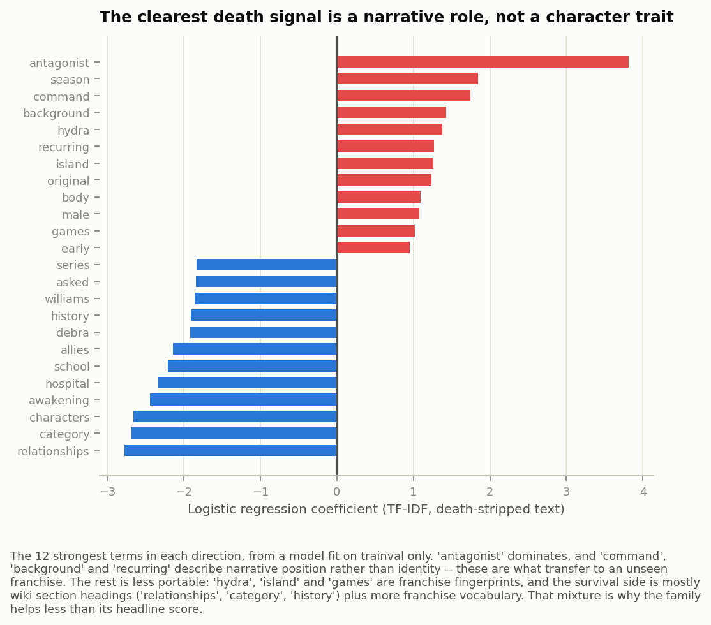

# Spoiler Alert: Who Makes It to the Finale?

**A Needle in a Data Haystack (67978) — Final Project, Group #56**

| Name | ID | CSE username | Email |
|---|---|---|---|
| Stav Abukarat | 322897687 | stava | stav.abukarat@mail.huji.ac.il |
| Shahar Spencer | 208067017 | shahar.spencer | shahar.spencer@mail.huji.ac.il |
| Bar Dalal | 212622260 | bar.dalal | bar.dalal@mail.huji.ac.il |
| Ido Oron | 208733634 | ido_oron | ido.oron@mail.huji.ac.il |

Interactive demo: **https://shaharspencer.github.io/needle-group-project/**

Code: see `README.md` for the full run order.

---

## Domain

Fictional characters die on purpose. Someone decides it, and that decision is
shaped by who the character is (how prominent, what role, what gender) and by
the show they're in: a Grey's Anatomy doctor and a Spartacus gladiator are not
facing the same odds. We wanted to know how much of that is visible in data, and
whether a character's own attributes or their franchise tells you more.

The unit of analysis is one character in one franchise, and the outcome is
binary: does this character die on screen over the course of the story as aired?
Everything comes from what fans wrote on wikis, plus cast data from TMDB.

---

## Data

**Where it came from.** We scraped 38 Fandom wikis through the MediaWiki API
(Game of Thrones, MCU, Star Wars, Harry Potter, Breaking Bad, and 33 more),
pulling each character page's infobox, full page text, and category tags.
That gave 68,463 pages. We enriched it with TMDB (280 titles, 28,151 cast
credits) for billing order, episode counts, genre and ratings, and pulled in
episode-level death registries and episode transcripts from Kaggle and
listofdeaths.fandom.com. The raw scrape is about 262 MB; the built modelling
table is 68,463 × 129.

**The label.** Death comes from the wikis' own infoboxes, not from us and not
from a model. Thirty wikis record a `status` string ("Deceased", "Alive");
eight instead record a date of death, where a filled field means dead. Both
conventions collapse into the binary modelling target `is_dead_v2`, which we
distinguish from the raw scraped `is_dead` because it makes one further
decision: a character whose status will not parse counts as alive instead of
being dropped. That affects 11.9% of the population and is discussed below. It
means 35.6% mortality is a floor, and that the models are trained against a
label that is conservative in a known direction.

**Not every page is a character.** This is the largest data-quality problem we
faced. To size it we drew a 600-page stratified sample and labelled every page
with Claude Haiku 4.5 against a written rubric: is this an individual character,
does it appear on screen, does it die. This is a single annotation pass, so we
have no inter-annotator agreement figure to report; the sample is used to size
the problem and to score the filter below, not as a gold standard we treat as
error-free.

Reweighted to the full corpus, 41% of pages are on-screen characters, 46% are
characters who exist only in novels or reference books (Star Wars Legends, Harry
Potter companion books), and 12% are not characters at all: creature types,
vehicles, and real historical figures picked up from the Young Indiana Jones
wiki. We restrict to on-screen characters using
`is_onscreen = has_actor OR tmdb_match`, which scores precision 0.79 / recall
0.77 against that sample. Neither signal works alone (0.61 and 0.58 recall),
which is why the rule combines them.

**Figure 1.** Composition of the 68,463 scraped pages. Three in five are not an
on-screen character; our analysis population is the leftmost segment only. We
drew this early and it changed how we scoped the project, since we had assumed a
character wiki was mostly characters.

Two further groups pass that filter and still have to be excluded:

- **168 pages that are objects, not people.** Talking portraits on the Harry
  Potter wiki ("Witch in portrait") and background paintings on the Star Wars
  wiki. A portrait is dead by definition — whoever it depicts died before the
  painting existed — so it is trivially separable by a death classifier without
  that telling us anything about characters. These pages alone inflated Harry
  Potter's mortality by six points (23.0% → 16.7% once removed).
- **1,122 unnamed background roles**, titled by job rather than name
  ("Unidentified Ugnaught worker", "Unnamed pilot"). These do appear on screen —
  TMDB credits background extras, so the names match real credits — but they
  aren't characters in the sense we're measuring, and our own annotation rubric
  already counted unnamed roles as non-characters. They're 6.7% of the on-screen
  set, over a third of Star Wars, and die at 22.7% against 35.6% for named
  characters, so leaving them in dragged the headline mortality down.

**Final analysis population: 15,686 on-screen, named characters, 35.6% of whom
die.** Both filters are pure functions of a page's own fields (an infobox tag, a
name pattern) — never the label, never a statistic over other rows — so they're
safe to apply before any train/test split exists. Setting
`INCLUDE_UNNAMED_ROLES=1` reproduces the numbers with the unnamed roles kept in;
it moves everything slightly and changes no conclusion.

**Known biases.** Star Wars is 56% of the raw scrape and still 12% after
filtering, so grouped cross-validation and per-franchise reporting do real work
throughout. Coverage is also uneven across wikis: The Walking Dead contributes
49 rows against a wiki with hundreds, and Stranger Things, Vikings, Spartacus
and Westworld are all thinner than the shows warrant, because those wikis use
infobox templates our page discovery does not match. Franchise-level results for
those five describe an arbitrary sample of the wiki, not the show, and we
exclude franchises under 30 characters from the franchise-level analysis for
this reason.

### Rows the infobox does not resolve

1,862 rows (11.9% of the population) had a status field that didn't parse into
anything usable, concentrated in four franchises: The Wire, Prison Break,
Boardwalk Empire and Lost, all between 46% and 85% unlabelled. Reporting those
franchises' mortality as-is would have been meaningless: Boardwalk Empire's
true rate was somewhere between 17% and 100% depending on how those rows
resolved.

Label sources are preferred in a fixed order: a human-curated death registry
where one exists, then the wiki infobox, then a language model (Claude Haiku
4.5) for whatever neither can settle. The registries do not reach these
franchises, so all 1,862 rows went to the model, batched 100 at a time, each
batch asked to read the wiki text and decide whether the character dies on
screen, with "can't tell" available as an explicit answer.

It returned a verdict on 1,858 of them: **123 dead, 1,223 alive, and 512 left
undecided — 27.6%.** We gave it the "can't tell" option deliberately: if it had
to answer every row we would have no way to tell the confident cases from the
guesses, and a quarter of these turned out to be undecidable from the page. The
death rate among the rows it did settle was 9.1%, close to the 8.5% the 600-page
sample implies for unlabelled rows.

These labels live in their own files (`data/gold/fill_unlabelled/`) and are
merged into neither `is_dead` nor `is_dead_v2`, so no model in Q1 or Q2 is ever
trained or scored against a label a language model produced. They feed exactly
one number: the Q3 mortality point estimates below.

### Checking the label against a separate source

The label and the features come from the same character pages, so we also check
it against a source that does not use those pages at all.
`listofdeaths.fandom.com` catalogues deaths episode by episode; we scraped its
Game of Thrones and The 100 entries and matched them to our characters by name. It is a different wiki, written by different editors and
organised by episode instead of by character, so it is not derived from the
infobox fields the label reads.

| franchise | matched 1:1 | registry says died, we say dead |
|---|---|---|
| Game of Thrones | 134 | 132 (98.5%) |
| The 100 | 68 | 65 (95.6%) |

**197 of 202 agree, 97.5%.** Two of the five disagreements look more like the
registry's problem than ours (Jaqen H'ghar doesn't die, he changes face; Ellaria
Sand is imprisoned, not killed). This measures recall only — a name missing from
a registry might have died off screen or in the books — so it says nothing about
precision.

The Fandom `Deceased` category is not a second such source, despite looking like
one. 7,388 pages carry it, and of the 7,128 with a parseable status, 96.6%
already say dead, the same editors recording the same fact through two wiki
mechanisms. So it tells us the wikis are internally consistent, which is not the
same as the label being correct.

---

## Question 1: Is it who you are, or what show you're in?

**Problem.** Can we predict whether a character dies from their attributes, and
which matters more — the character or the franchise?

**Solution.** Nine feature sets crossed with three models (logistic
regression, decision tree, random forest), so the comparison isolates the
feature families, not the estimator. The sets: franchise metadata only;
character attributes only; character without wiki-metadata proxies; character +
franchise; franchise + network centrality; character + network; TF-IDF over
page text alone; character + text; and everything, which adds 369 one-hot
Fandom category and infobox-field features.

Character features are gender, archetype (a keyword rule over infobox
title/occupation, since there's no clean occupation column), alignment,
prominence tier, billing order, episode count, page length, a de-leaked infobox
field count, and several has-this-field flags. Network features come from a
per-franchise co-mention graph built from page text: PageRank, HITS hub and
authority, in/out degree, component size. Every feature's exact definition and
computation is in `FEATURES.md`.

The text features require care about leakage. A dead character's opening
paragraph says "was killed by", so TF-IDF over raw text largely rediscovers the
label instead of predicting it. The text is therefore stripped twice before
vectorising: every sentence mentioning death *or survival* is dropped, then any
surviving death token is removed. Survival words matter as much as death words:
"still alive" is the label with the sign flipped. We verified that the resulting
300-term vocabulary contains no death or survival token, and that tense markers
are not carrying the label either: "is" and "was" are English stopwords and
already excluded. The vectoriser is fit inside the cross-validation pipeline, so
the vocabulary and IDF weights never see a test document.

**Two split rules, because they answer different questions.** Under **random
CV** (stratified 5-fold over characters) a franchise appears in both the training
and the validation folds, so the model can learn its base rate. That is the only
setting in which "a GoT character vs a Harry Potter character" is a fair
comparison. Under **grouped CV** (`GroupKFold` on franchise) whole franchises
fall on one side or the other, so franchise identity is useless by construction
and the score measures whether character attributes transfer to a show the model
has never seen. Each rule is applied twice: once for the cross-validated feature
comparison below, and once for the single test estimate that follows it.

**Evaluation criteria.** PR-AUC as the headline, since the classes are
imbalanced (35.6% positive) and PR-AUC's chance level is the base rate rather
than 0.5. Two baselines: majority class and prior. Preprocessing (imputation,
scaling, one-hot encoding) all sits inside the CV pipeline so nothing is fit
across a fold boundary.

**Results.** Cross-validated PR-AUC, best model per feature set. Bold marks the
best score in each column; the two leaders under grouped CV are tied at three
decimal places.

| features | random CV | grouped CV |
|---|---|---|
| everything | **0.743** | **0.545** |
| character + text | 0.699 | **0.545** |
| character + franchise | 0.692 | 0.485 |
| character + network | 0.680 | 0.519 |
| franchise + network | 0.650 | 0.486 |
| text only | 0.650 | 0.509 |
| character only | 0.633 | 0.487 |
| character, no wiki metadata | 0.590 | 0.504 |
| franchise only | 0.556 | 0.398 |
| baseline | 0.356 | 0.356 |

**Figure 2.** PR-AUC by feature set, one panel per split rule. Left: random CV,
where the model can see the franchise. Right: grouped CV, where whole franchises
sit out. Every bar shortens on the right. The ones that shorten least describe
the story; the ones that collapse describe the wiki.

Character attributes beat franchise identity (0.633 vs 0.556), and the two are
complementary: combining them beats either. So the answer is "both, and mostly
who you are," with a large caveat: the full model loses 0.198 PR-AUC moving from
random to grouped CV (0.743 → 0.545). Much of what looks like character-level
signal under random CV is the model learning per-show base rates.

The feature families divide sharply on whether they transfer. Text is the
strongest addition in the table and is treated separately under Q2. Network
centrality also travels: adding it to franchise metadata is worth +0.094 under
random CV and +0.088 under grouped CV, since PageRank over a co-mention graph
describes a character's position in their own story, not the show's vocabulary.
Fandom category features show the opposite profile, a large mover under random CV
and much weaker under grouped, because they encode
franchise-specific role vocabulary ("Jedi", "Death Eater") that means nothing in
another franchise.

**The test estimate.** The comparison above is designed to rank feature
families, so it reports the best configuration in each row. A separate, stricter
protocol gives the performance estimate: an 80/20 `trainval`/`test` split, with
model selection by k-fold *inside* trainval and the test set scored exactly once.
Under the random rule the split is stratified on the label. Under the grouped
rule whole franchises have to go to one side, and since franchise sizes span
three orders of magnitude we assign them greedily largest-first, each one going
to whichever side is currently furthest below its 80/20 target, so that no single
large franchise decides the split.

| split rule | chosen | trainval CV PR-AUC | test PR-AUC | test ROC-AUC |
|---|---|---|---|---|
| random | everything / random forest | 0.732 | **0.752** | 0.850 |
| grouped | everything / random forest | 0.562 | **0.664** | 0.776 |

Under both rules the test score came in above the cross-validated estimate that
selected it, which is the reassuring direction: overfitting the selection
procedure would have shown up as test falling short of CV. We would not read
much into the size of the gap under the grouped rule (0.562 to 0.664), since
there are only 38 franchises and the score depends a good deal on which of them
happened to land in the test set.

**What limits these numbers.** Two problems sit underneath the grouped-CV
column specifically. First, we impose no minimum franchise size, so folds are
very unequal: Prison Break contributes 28 characters and the MCU 3,489, and each
is one fold. Second, some features are missing for whole franchises instead of
at random. `n_relatives` is 0 across six franchises (33.7% of characters,
including the MCU) because those wikis do not use the family infobox keys. A
held-out franchise can therefore be missing a feature the model learned to lean
on, which makes the grouped column a pessimistic estimate of transfer rather
than a clean one. We report it as-is because what the comparison rests on is the
direction of the drop, not its exact size.

**Feature importance** (permutation, character-only forest): page length 0.167,
archetype 0.111, gender 0.107, de-leaked field count 0.101, prominence tier
0.101, billing order 0.092.

**Figure 3.** Permutation importance, character-only forest. Colour separates
attributes of the character from measurements of the wiki page. The two strongest
features are wiki measurements, which is our biggest caveat and why the
Conclusion treats these results as descriptive.

### Gender, specifically

Being female roughly halves the odds of dying: **OR 0.564, 95% CI 0.516–0.616**,
about 11.1 percentage points lower death probability after adjusting for
prominence, role, alignment, species and franchise (logistic regression with
franchise fixed effects, n=14,106). The unadjusted gap is 14.5 points, so a bit
under a quarter of the raw difference is explained by men holding more disposable
roles.

Of 22 franchises where the effect could be estimated separately, **11 reach
p<0.05 and none point the other way.** These per-franchise tests are
uncorrected for multiple comparisons, so the claim we are making from them is
the consistent direction rather than any individual franchise's significance.
The weak cases (Grey's Anatomy, Avatar, The Sopranos) are null effects, not
reversals. The estimate is also
insensitive to the population definition: it moves by a few thousandths of an
odds ratio under each of the inclusion rules described in the Data section.

**Figure 4.** Per-franchise odds ratios with 95% intervals; filled markers reach
p<0.05. Every point sits left of 1, which is the claim: the effect is consistent
in direction even where it is not significant. The widest intervals belong to the
smallest franchises, so the pooled estimate is the one to read.

### What the model gets wrong

We ranked the out-of-fold trainval predictions by error (never test) and looked
for patterns in the worst 100. One candidate explanation did not hold: pages
named by relation to someone else ("Alastor Moody's mother") are not a distinct
failure mode. They are *less* likely to die than average (29.8% vs 35.6%) and
are not overrepresented among the largest errors.

Two franchises are overrepresented, and they fail in opposite directions:

- **Spartacus** is 1.4% of trainval rows and 14% of the worst 100 errors, a 10x
  overrepresentation. Widening from the worst 100 to every Spartacus row with an
  absolute error above 0.5 gives 47 of them, and 40 run the same way: the model
  confidently predicts death for characters who survive. Base mortality is 71%,
  so "prominent + military + this franchise → dies" is right most of the time and
  wrong precisely for the show's leads. Centrality does not rescue it: Agron and
  Nasir are both highly central, and PageRank cannot distinguish "central and
  dies" from "central and survives".
- **Grey's Anatomy** is the mirror image: 2.5x overrepresented, and on the same
  widened count all 42 of its errors above 0.5 run the other way, with characters
  who die predicted as very likely to live. Base mortality is 9.3%, so the model has learned that almost
  nobody dies on this show, right nine times in ten, and wrong for every
  one-off death.

Both are base-rate anchoring, in opposite directions, and nothing in our feature
set separates a central character who dies from a central character who survives.
We could have added franchise-specific corrections for these two, but that would
hide a real limit of what wiki metadata supports, so we left them in.

---

## Question 2: Does the text about a character predict their death?

**Problem.** Does unstructured text carry signal about a character's fate beyond
what their structured attributes already say?

**Solution.** TF-IDF over each character's wiki description, death- and
survival-stripped by the two-pass procedure described in Q1, vectorised inside
the cross-validation pipeline so no test document informs the vocabulary or the
IDF weights. We evaluate it two ways: alone (`text`), and added to the character
attributes (`character + text`), under both split rules, against the same
baselines as Q1.

**Results.** Text is the most valuable feature family in the project. Adding it
to character attributes is worth +0.066 PR-AUC under random CV and +0.058 under
grouped CV, and `character + text` is the best grouped-CV configuration in the
entire comparison at 0.545, level with the everything-model, which carries 369
more columns and reaches the same score. Text alone (0.650) beats character
attributes alone (0.633) outright.

It is also the only family that transfers as well to an unseen franchise as to a
familiar one, and the fitted coefficients show partly why. The strongest term by
a wide margin is `antagonist` (+3.81), and several others describe narrative
position rather than identity: `command`, `background`, `recurring`, and lower
down `military` and `criminal`. Those mean the same thing in any franchise, which
is why they survive the move to a show the model has not seen.

The rest is less portable, and the figure below shows where. `hydra`, `island`
and `games` sit high on the death side and are franchise fingerprints, not roles.
The survival side is mostly wiki structure: `relationships`, `category`,
`characters` and `history` are section headings that describe the page, not the
character, mixed in with more franchise vocabulary (`hospital`, `debra`,
`awakening`). Only part of this family carries transferable signal, which is why
text helps as much as it does and no more.

**Figure 5.** Strongest TF-IDF coefficients in each direction. The transferable
signal is real but partial: `antagonist`, `command`, `background` and `recurring`
would mean the same thing in a franchise the model has never seen, while `hydra`,
`island` and `games` sit on the same side and would not.
`src/q2_text/coefficients.py` writes these weights and asserts that no death or
survival token survived the stripping, so the vocabulary can be checked directly.

**Scope.** This answers the question for descriptive text about a character, not
for dialogue. We hold transcripts for 1,136 episodes across 11
shows, but an episode-level death registry for only two of them, so the largest
transcript set (Grey's Anatomy, 464 episodes) has no outcome to align against;
most transcripts also carry no speaker labels, making attribution of a line to a
character a prerequisite problem in its own right. A dialogue model fit on the
two aligned shows would not support a claim about the other nine.

---

## Question 3: Are some franchises just deadlier?

**Problem.** Do mortality rates differ by franchise, and do franchise
properties (genre, medium, age, length, rating) explain the difference?

**Solution.** One row per franchise, with mortality plus TMDB properties, and
weighted least squares on logit(mortality) against first release year, run span,
number of titles, medium and mean audience rating. Rows are weighted by cast
size, so a franchise with 40 characters does not count the same as one with
4,000. We fitted a binomial GLM over character counts first and rejected it:
characters within a franchise are plainly not independent draws (Pearson
chi-square/df of 36.6), and it returned p < 1e-10 on every term from 38 data
points. Weighting a franchise-level model by cast size keeps the size
information without pretending the sample size is the character count. Then k-means over the property
vectors, with k chosen by silhouette and checked for stability across 10
seeds.

**Which rows Q3 counts.** Mortality here is computed over 17,584 on-screen,
named characters, not the 15,686 that reach the modelling table. The difference
is characters whose infobox status never parsed at all. They are dropped from
Q1 and Q2 because they have no usable label to train against, but dropping them
from a mortality rate would bias it, since a page with no recorded status is
more likely to belong to a character nobody wrote much about than to a
prominent death. We keep them in the denominator and carry the resulting
uncertainty explicitly, as below.

**Handling label uncertainty.** For the four franchises that are mostly
unlabelled, a single mortality figure would be indefensible, so we report the
bounds alongside the estimate: a lower bound with unparsed rows counted alive, an
upper bound with them counted dead, and a point estimate that uses the
model-supplied labels described above wherever they resolved a row.

| franchise | unlabelled | resolved | bounds | point estimate |
|---|---|---|---|---|
| The Wire | 214 | 200 (93.5%) | 14.3–99.2% | 16.3% |
| Prison Break | 155 | 143 (92.3%) | 6.6–91.3% | 21.3% |
| Boardwalk Empire | 440 | 329 (74.8%) | 19.7–99.8% | 23.2% |
| Lost | 330 | 203 (61.5%) | 23.2–69.0% | 26.6% |

The bounds are wide enough that these four franchises carry little weight in
what follows. The simpler alternative would be to assume the corpus death rate
applies to unlabelled rows too; comparing that against our resolved labels, the
two agree for Lost (26.6% vs 27.1%) and diverge for Prison Break (21.3% vs
13.8%). That is the pattern we would expect, since a flat corpus-wide rate is
least reliable for a show whose own mortality profile is unusual.

**Results.** Mortality does vary a lot by franchise, from Grey's Anatomy at
9.3% to The 100 at 72.7% among franchises with at least 100 characters. But
franchise *properties* explain none of it. No term in the weighted model reaches
significance: run span is the closest at p=0.185, and medium, number of titles,
first release year and audience rating are all further away. **R² = 0.079,
adjusted R² = −0.065** across the 38 franchises in the model, meaning it does
worse than predicting every franchise at the overall mean.

**Figure 6.** Mortality per franchise with both sources of uncertainty attached.
The grey bar is the 95% Wilson interval from sampling; the blue band is how far
the estimate could move if every character with no recorded status turned out to
have died. The four franchises with a long band are the ones discussed above.

**Figure 7.** Franchise mortality against run span, marker size proportional to
cast size. The fit is flat and the cloud is diffuse, which is more informative
than the p=0.185 on its own.

One measurement choice decides whether this is a null result at all, so it is
worth spelling out. Run span has to be the interval a franchise was in
production, which for a film series is the spread of its release years but for a
television series is first air date to last air date. A series is a single TMDB
title, so taking the spread of release years records every show as spanning zero
years regardless of how long it actually ran. Defined on release years alone,
run span reaches p=0.022 and the model an adjusted R² of 0.047; defined
correctly, both vanish. The apparent effect was the variable separating
multi-film franchises from television, not measuring duration.

k-means doesn't recover mortality groupings either. Best silhouette is k=2
(0.43, stable across 10 seeds), and that split mostly separates six large
multi-title film franchises from the other 32, landing at 35.4% and 37.1%
mortality, not a meaningful gap given the label uncertainty above.

So Q3 gets a clean negative answer: franchises differ enormously in how deadly
they are, and none of the franchise metadata we have predicts which ones.
Whatever drives the difference (tone, genre convention, a showrunner's
willingness to kill a lead) is not in TMDB's fields.

---

## Future Work

The obvious next question is dialogue, which is blocked on alignment rather than
on data volume: per-episode death registries exist for two of our eleven
transcript shows, and most transcripts carry no speaker labels, so attributing a
line to a character has to be solved first. Second, a proper reliability figure
for the annotation, since a second pass over the 600-page sample would give a
Cohen's kappa where we currently have none. Third, the franchise-level feature
gaps above: either handle per-franchise missingness deliberately or restrict
grouped CV to franchises carrying the full feature set, with a minimum franchise
size imposed at the same time. The most interesting extension is harder. Every feature we
have is retrospective, so testing whether a death was actually foreseeable would
mean rebuilding the features from what was knowable partway through a series and
predicting forward from there.

---

## Conclusion

Character attributes carry more signal about death than franchise identity does,
and the two combine: 0.633 PR-AUC from character features alone against 0.556
from the franchise, and 0.743 from everything together, against a 0.356 base
rate. On the test set the full model reaches **0.752 PR-AUC / 0.850 ROC-AUC**
under a random split and **0.664 / 0.776** when whole franchises are held out.
The most useful single addition was text: TF-IDF over each character's
death-stripped wiki description, which on its own beats their structured
attributes and is the only feature family that helps as much on an unseen
franchise as on a familiar one. The gender effect is real and stable:
women are about half as likely to die, adjusted, consistent across 11 of 22
franchises with no reversals. Franchise-level properties, by contrast, explain
none of why some shows kill more than others: no term in the model reaches
significance and adjusted R² is negative.

The main limitation is the data itself. A wiki is written after the story is
over, by people who write more about the characters they cared about. Our two
most important structured features, page length and infobox field count, are
therefore measuring fan attention, and death attracts fan attention. So what we
have shown is what separates characters who died from those who did not in
retrospective accounts. We have not shown that a death was foreseeable from what
a viewer knew at the time. The two families that escape this are the ones built
from the story's own structure instead of from how much was written about it:
network centrality and the narrative-role vocabulary in the text features. Those
are also the two that survive being moved to a franchise the model has never
seen.
