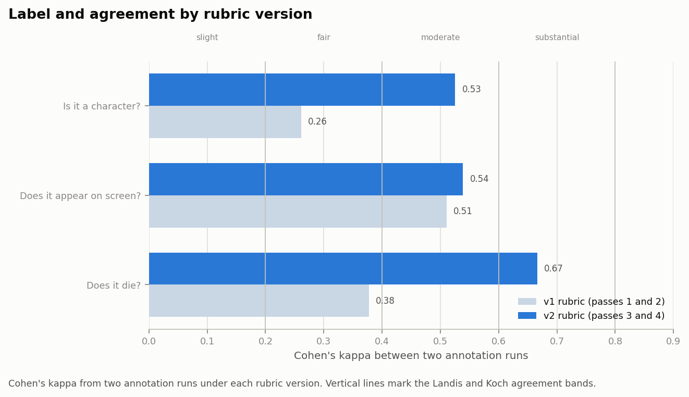
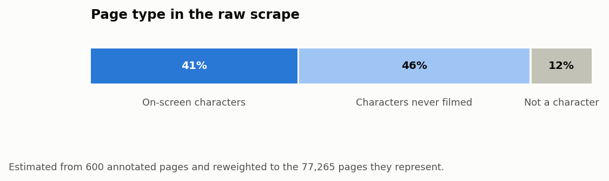

# Spoiler Alert: Who Makes It to the Finale?

**A Needle in a Data Haystack (67978), Final Project, Group #56**

| Name | Email | CS id |
|---|---|---|
| Stav Abukarat | stav.abukarat@mail.huji.ac.il | stava |
| Shahar Spencer | shahar.spencer@mail.huji.ac.il | shahar.spencer |
| Bar Dalal | bar.dalal@mail.huji.ac.il | bar.dalal |
| Ido Oron | ido.oron@mail.huji.ac.il | ido_oron |

Demo: **https://shaharspencer.github.io/needle-group-project/**

## Domain

Our domain is fictional characters in film and television franchises. For each
character we ask a binary question: does this character die on screen, or at
least die as part of the story that viewers see?

We looked at this at two levels. At the character level, we test whether death is
mostly predictable from the character and their role in the story, or from the
franchise they belong to. At the franchise level, we test whether genre, medium,
rating, release year, or run length explains mortality differences.

Several features can act as shortcuts. Wikis are written after the story is
known, popular characters have longer pages, and some franchises document status
more carefully than others. A model can score well by learning those wiki
habits, so we report leakage checks and grouped validation alongside the final
scores.

## Data

We scraped 38 Fandom wikis, including Game of Thrones, the MCU, Star Wars, Harry
Potter, Breaking Bad, and 33 others. The raw scrape contains 68,463 pages and
about 262 MB of JSONL. From TMDB we added 280 titles and 28,151 cast credits,
mainly for billing order, title counts, episode counts, genre, and rating. We
used two Kaggle death registries and `listofdeaths.fandom.com` only as validation
sources, not as training labels.

Each row represents one wiki page. The columns combine infobox fields, page and
category metadata, TMDB cast information, text features, and graph measures.

The main label, `is_dead_v2`, is built from infobox fields. Thirty wikis expose
a status string, and eight mainly expose a date-of-death field. For Q1 we drop
characters whose death status cannot be parsed. For the franchise-level
analysis, where dropping whole groups would bias franchise mortality rates, we
labelled 1,858 of these unclear cases with Claude Haiku 4.5 using a written
rubric and a "can't tell" option. This added 123 dead, 1,223 alive, and 512
undecided labels.

### Label quality

We treated labelling as part of the evaluation. PR-AUC and kappa do not mean
much if the labels are shaky, so we checked both consistency and external
agreement.

For each rubric version, we ran two annotation runs on the same stratified sample
of 600 pages. Since we did not have human coders, these numbers measure the
repeatability of the rubric and model, not human agreement. We report Cohen's
kappa because most characters survive, and raw agreement would look acceptable
even if both runs simply defaulted to "alive".

The first rubric left several edge cases unclear, especially historical figures
played by actors inside a fictional story. After writing those rules explicitly,
kappa for death increased from 0.38 to 0.67 and kappa for identifying character
pages increased from 0.26 to 0.53. On-screen kappa changed only from 0.51 to
0.54. Raw agreement for death increased from 0.70 to 0.84.

*Figure 1: label agreement by coding pass.*

Agreement between `is_dead_v2` and the annotation pass was 0.86 kappa on the
first pass (n = 296) and 0.65 on the second (n = 405). This is still partly an
internal check, because both use the same wiki pages. The better external check
is against `listofdeaths.fandom.com`, which is maintained by different editors.
For Game of Thrones and The 100, 197 of 202 characters matched to the external
death list had the same death label in our data. Since that registry mostly
lists deaths, this checks recall more than false positives.

### Data quality and filtering

The raw scrape contains many pages that are outside our question. In the
annotated sample, reweighted by stratum, only 41% of pages are on-screen
characters. Another 46% are novel-only or reference-only pages, and 12% are not
characters at all.

*Figure 2: page type vs share of the raw scrape.*

We kept a page if the infobox named an actor or if we matched the page to a TMDB
cast credit. Against the annotated sample, this filter has precision 0.79 and
recall 0.77. We also removed 168 object pages, mostly portraits and items that
were dead by definition, and 1,122 unnamed background roles.

The final Q1 population has 15,686 named on-screen characters, 35.6% of whom die.
The franchise distribution remains uneven. Star Wars is 56% of the raw scrape
and 12% after filtering, so every Q1 result is reported both under random
cross-validation and under grouped cross-validation by franchise.

## Q1: Do character attributes predict death better than franchise identity?

### Problem description

The first question is whether death is mostly a property of the franchise or of
the character. A model that only memorises franchise averages will fail on a new
franchise. We also examine network position, fate concentration within graph
communities, gender differences, prediction errors, and decision thresholds.

### Our solution

We trained logistic regression, a decision tree, and a random forest on 12
feature sets: franchise metadata, character attributes from infoboxes and TMDB,
co-mention centrality, Louvain community position, TF-IDF over de-leaked wiki
text, and combinations of these groups. The largest representation has 369
one-hot columns from Fandom categories and infobox fields.

All three models use `class_weight="balanced"` because the positive class is
only 35.6%. Without this, a classifier could perform well on accuracy by mostly
predicting survival. We did not tune logistic regression separately for every
feature set because the point of this experiment is the comparison between
feature groups, not the best possible score from each group. The random forest
uses 400 trees, where the out-of-fold score stopped improving in our runs.

The supervised learning lecture distinguishes pre-pruning from post-pruning as
ways to control tree complexity. Our unpruned tree reached depth 36 with 4,315 leaves and only
0.375 PR-AUC under grouped CV, barely above the 0.356 base rate. Pre-pruning
with `max_depth=6` and `min_samples_leaf=50` reached 0.462 PR-AUC with 43
leaves. Cost-complexity post-pruning with `ccp_alpha=0.001` reached 0.475 with
17 leaves. Since the two pruned versions were close in score, we used the
smaller post-pruned tree.

To model social position, we built a co-mention graph for each franchise. There
is an edge from character A to character B when all name tokens of B appear on
A's wiki page. The edge is weighted more strongly if the mention is reciprocal.
From this graph we extracted PageRank, HITS hub and authority scores, in-degree,
and out-degree.

We also partitioned each franchise graph using Louvain community detection.
Louvain greedily maximises modularity and is practical for weighted graphs;
Girvan-Newman, the other method covered in the community-detection lecture,
repeatedly recomputes edge betweenness and was too expensive for our largest
graph. The Star Wars graph alone has 42,268 nodes. Since Louvain can depend on
node order, we ran five seeds per franchise. Across runs, 92% of character pairs
agreed on whether they belonged to the same community, and modularity changed by
at most 0.008.

Across the 38 franchises, Louvain found 1,885 communities. Median modularity was
Q = 0.426, and 36 of 38 franchises were above the lecture's Q > 0.3 heuristic
for visible community structure. Peaky Blinders and Supernatural were below
that threshold, so we treated their community features cautiously.

For each character we used community size, the community's share of the cast,
embeddedness, and degree rank. We did not include the community id itself,
because it is an arbitrary label and would mostly give the model another way to
memorise franchise-specific groups.

For text, we removed sentences that mention death or survival, fit the TF-IDF
vectoriser inside each CV fold, and then checked the selected 300 terms against
the same death-pattern list. If terms such as "was killed" or "death" enter the
vocabulary, the task becomes label extraction.

### Evaluation criteria

The prevalence baseline has 0.356 PR-AUC. A dummy classifier that samples from
the class prior scores 0.356 under random CV and 0.326 under grouped CV. We use
PR-AUC as the main metric because death is the minority class; as discussed in
the evaluation lecture, different metrics can rank the same models differently.
ROC-AUC is reported as a secondary metric. Accuracy is a poor fit here, since
the majority baseline already reaches 64.4%.

### Setup

We ran two cross-validation settings on all 15,686 Q1 characters.

In random 5-fold CV, characters from the same franchise can appear in both train
and validation folds. In grouped 5-fold CV, `GroupKFold` holds out whole
franchises. The grouped setting asks whether the model transfers to a franchise
it has never seen.

For the final evaluation, we made separate random and franchise-grouped 80/20
splits. Within each 80% training portion, we selected the model using five-fold
cross-validation, refitted it on the full training portion, and evaluated it
once on the untouched 20% test set.

### Results

Character attributes beat franchise identity on their own: 0.633 PR-AUC versus
0.556 under random CV. Combining them improves the score further. The full model
reaches 0.744 under random CV, but drops by 0.189 under grouped CV. That drop is
the main warning sign. A large part of the random-CV score comes from information
that does not transfer cleanly across franchises.

*Figure 3: feature set vs PR-AUC.*

Franchise identity is especially weak under grouped CV, where it falls to 0.398
PR-AUC. For an unseen franchise, the one-hot franchise column is all zeros, so
the model is left with only coarse metadata such as genre, medium, rating, and
year. Community features add 0.024 over character attributes alone, but only
0.004 once centrality is already included.

We also compared every feature set against character-only using paired fold
scores. With only five paired folds, the smallest possible Wilcoxon p-value is 0.0625,
so we mainly look at fold wins and spread. Random folds have spreads of 0.009 to
0.013 PR-AUC; grouped folds are wider, 0.034 to 0.082, often larger than the
gap between feature sets.

*Figure 4: feature set vs fold-level PR-AUC.*

The strongest mean paired improvements over character-only are the all-feature
model (+0.077 grouped, 5/5 folds; +0.111 random, 5/5) and character+text (+0.051
grouped, 5/5). Network and community variants are less stable under grouped CV,
usually winning only three folds out of five. Community-only and franchise-only
are both worse than character-only under grouped CV.

We separately tested whether deaths are concentrated within graph communities,
even though community features add little to the classifier. For each franchise
we computed:

`D = P(same fate | same community) - P(same fate | different community)`

We compared D to 2,000 within-franchise label shuffles, keeping the graph and
the franchise death rate fixed. This adapts the pairwise community-membership
comparison from the community lecture to character fate.

Five franchises had too few characters or communities for this test, leaving 33.
Thirteen franchises exceeded the one-sided null at p < 0.05. The largest effects
were in serialised drama: Lost (D = 0.109, z = 15.1), the Breaking Bad universe
(D = 0.115, z = 9.3), Dune, Game of Thrones, and The 100. The cast-weighted mean
D across all franchises was only +0.012, so this is not a universal effect.

*Figure 5: franchise vs fate concentration.*

The one-sided test only flags positive clustering. Four franchises, the MCU,
Grey's Anatomy, Ozark, and Spartacus, had z-scores below -2.3, meaning same-fate
pairs were less concentrated within communities than expected. We did not apply
a multiple-comparisons correction across the 33 tests, and Supernatural was one
of the positive franchises despite having low modularity (Q = 0.234). We treat
the community-death relationship as visible in some franchises, but not stable
enough to call general.

On the held-out test split, the all-feature random forest scored 0.756 PR-AUC /
0.849 ROC-AUC under a random split and 0.667 / 0.772 when whole franchises were
held out. Both are above the corresponding CV estimates. With only 38
franchises, the grouped result still depends heavily on which franchises land in
the held-out set.

Permutation importance on the character-only forest ranks page length first
(0.167), then archetype (0.111), gender (0.107), de-leaked field count (0.101),
prominence tier (0.101), and billing order (0.092). The top features are partly
measurements of wiki attention rather than properties of the character. We
computed permutation importance on the training data, so the reported drops are
likely optimistic. We therefore use the ranking only as a rough indication of
which features the model relies on.

*Figure 6: feature vs permutation-importance drop.*

For gender, we fit an adjusted model. Women have about half the odds of dying
compared with men (OR 0.564, 95% CI 0.516 to 0.616), after adjusting for billing
order, archetype, alignment, human/nonhuman status, and franchise. The
unadjusted gap is 14.5 percentage points; the adjusted gap is about 11.1 points.
None of the 22 franchises where the franchise-specific effect was estimable
reversed direction.

*Figure 7: franchise vs gender odds ratio.*

### Impediments

The biggest modelling issue is that prediction cost depends on the use case. If
false spoilers are much worse than missed deaths, we want a high threshold. If
missed deaths are worse, we want a low threshold. We scored thresholds using
`w1 * FN + FP`, where `w1` is the cost of one missed death relative to one false
alarm. The best global threshold moves from 0.80 when `w1 = 0.5` to 0.13 when
`w1 = 10`.

*Figure 8: threshold vs weighted loss.*

The errors are also franchise-specific. Here, the worst 100 are the rows with
the largest absolute difference between the predicted probability and the true
label. Spartacus contributes 13% of them while making up only 1.5% of the data.
All 13 are false positives,
despite the franchise's 73.4% mortality rate. Grey's Anatomy is overrepresented
by a factor of 2.6, with nine false negatives among the worst 100 errors. At
`w1 = 3`, the
best franchise-specific threshold is 0.05 for Spartacus and 0.64 for Grey's
Anatomy. We did not use franchise-specific thresholds in the main model because
they require labelled examples from the target franchise, which grouped CV
deliberately withholds.

## Q2: Are some franchises deadlier?

### Problem description

For Q2, the unit of analysis is the franchise. We estimate each franchise's
mortality rate and test whether observable franchise properties explain the
differences. We also cluster franchises using non-mortality properties and check
whether the resulting groups differ in mortality.

### Our solution

We first tried a character-level binomial GLM with franchise properties as
predictors. It returned p < 1e-10 for almost everything because it treated
characters from the same franchise as independent observations. The 3,647 MCU
characters are not 3,647 independent franchises. The Pearson chi-square divided
by degrees of freedom was 36.6, far from the expected value near 1.

For the main analysis we collapsed to one row per franchise and regressed
`logit(mortality)` on first year, run span, title count, medium, and rating,
weighted by cast size. This gives the correct unit of analysis, but only 38
rows. A later version could use a mixed-effects or quasibinomial model to retain
the character-level data while accounting for dependence within franchises.

Run span is measured from first to last air date. A release-year-based span
version gave p = 0.022, but it conflates long-running TV shows with multi-film
franchises. Because this modelling choice affects significance, we report the
air-date version and treat the p-values cautiously.

For clustering, we used eight franchise properties and excluded mortality.
Including it would build the outcome into the clusters, making any later
mortality difference circular. We standardised all columns before k-means
because Euclidean distance would otherwise mostly measure variables with large
numeric ranges, especially release year and title count. We used k-means++ with
ten seeds to reduce sensitivity to random initialisation, as recommended in the
clustering lecture. We chose k by silhouette score and also plotted the elbow
curve.

### Evaluation criteria

For the regression, a franchise property counts as explanatory only if it is
significant at p < 0.05 when the franchise is the unit of analysis and if the
model improves adjusted R-squared over the mean-only baseline.

For clustering, we first use internal validation from the clustering lecture:
cohesion, separation, silhouette, and agreement with Ward agglomerative
clustering. We then use an external check: whether the clusters differ in
mortality, which was not used to build them. We also report purity and entropy
against medium, but we treat that as a weak check because medium is partly
recoverable from the features we did cluster on.

### Setup

The Q2 population has 17,584 named on-screen characters, larger than Q1's 15,686.
We include characters with unclear parsed status because dropping them would
distort franchise rates. For the four franchises with many unclear labels, we
report a lower bound assuming all unclear characters survived, an upper bound
assuming they died, and a point estimate using the Haiku-resolved labels. All
rates use Wilson intervals, which behave better than normal intervals for small
or extreme proportions.

### Results

Among the 25 franchises with at least 50 characters and at least 90% status
coverage, mortality ranges from 9.3% for Grey's Anatomy to 72.6% for The 100.
The Walking Dead reaches 79.5%, but it has only 44 characters in our filtered
data.

*Figure 9: franchise vs mortality rate.*

None of the tested franchise properties is significant in the collapsed
regression. Run span is closest, with p = 0.185. The model R-squared is 0.079
and adjusted R-squared is -0.065. The predictors explain little variation and
do not improve on the mean-only model once their number is taken into account.

The four lowest-coverage franchises have the widest bounds. The Wire ranges
from 14.3% to 99.2% using infobox evidence alone, with a Haiku-assisted point
estimate of 16.3%. Lost ranges from 23.2% to 69.0%, with a point estimate of
26.6%. We show these rows to make the uncertainty visible, but do not use them
as strong evidence for comparisons.

*Figure 10: run span vs mortality rate.*

The silhouette score peaks at k = 2 (0.428). Across ten seeds, 92.5% of
franchise pairs were assigned consistently. The elbow curve does not support a
clear k; average distance to centroid falls smoothly from 2.41 at k = 2 to 1.21
at k = 8. Silhouette prefers two clusters, but the elbow plot does not show a
strong natural break.

*Figure 11: number of clusters vs internal clustering diagnostics.*

At k = 2, the mean distance within clusters is 2.82 and the mean distance
between clusters is 5.60, a ratio of 1.98. The correlation between distance and
same-cluster membership is -0.65, as same-cluster pairs tend to be closer. Ward
agglomerative clustering cut at k = 2 agrees with k-means on 94.7% of franchise
pairs.

At k = 2, six large, multi-title film franchises are separated from the other 32
franchises. Their mortality rates are 35.4% and 37.1%, an observed difference of
1.7 percentage points. Purity against medium is 0.684 and entropy is 0.804, but
this is a weak external check because title count and related variables already
distinguish film franchises.

### Impediments

Q2 is limited by the small number of franchises. Once the analysis is collapsed
to one row per franchise, we have only 38 observations. This removes the
spuriously small p-values from the character-level model, but also makes moderate
effects difficult to detect.

The second limitation is label coverage. Four franchises have particularly weak
parsed status fields, so we report ranges rather than single estimates.
Re-scraping the same wikis would not solve this because the fields are missing
or inconsistent at the source.

## Interactive demo

The demo, **Plot Armor Index**, is available at:
https://shaharspencer.github.io/needle-group-project/

It is a browser-only logistic regression. The demo uses fewer features than the
full Q1 model so it can run locally in the browser. One tab looks up a held-out
test character and breaks down the score by feature. The other lets the user
build a character manually and see how the predicted risk changes.

Code references are collected here: labels and reliability are in `src/labels/`,
Q1 is in `src/q1_character/`, and the franchise analysis is in
`src/q3_franchise/mortality.py` (the directory keeps its original pipeline
number). The demo export is in `src/app/export_demo.py`, and feature definitions
are in `FEATURES.md`.

## Future work

Our first priority would be human double-coding of the 600-page label sample. On
the modelling side, we would add features available partway through a story,
train for unequal error costs, and test overlapping communities. Speaker
attribution would make the 1,136 transcripts usable, while a mixed-effects or
quasibinomial model would be a better fit for the franchise analysis.

## Conclusion

Character-level information predicts death better than franchise identity:
0.633 PR-AUC versus 0.556 under random CV, with a 0.356 base rate. The
all-feature model reaches 0.756 PR-AUC and 0.849 ROC-AUC on the held-out random
test split, and 0.667 / 0.772 when whole franchises are held out. Text is the
most useful single addition to character attributes under grouped CV (+0.051
PR-AUC), while network and community features are smaller and less stable.

At the franchise level, mortality varies a lot, but the properties we tested
do not explain that variation. The collapsed regression has negative adjusted
R-squared, and the k = 2 franchise clustering separates large film franchises
from the rest without separating mortality.

Our main caveat is that the best predictive features are also the most
suspicious ones. Page length and infobox density partly measure fan attention,
and fan attention is affected by the character's full story. We used grouped
cross-validation, leakage checks, and external label validation to avoid
mistaking wiki-writing patterns for a model of character death.
