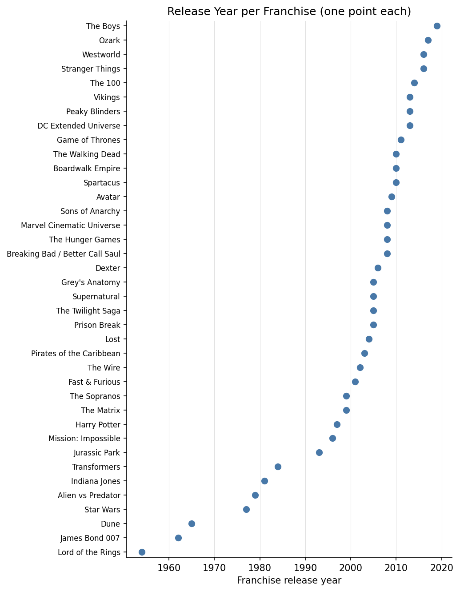
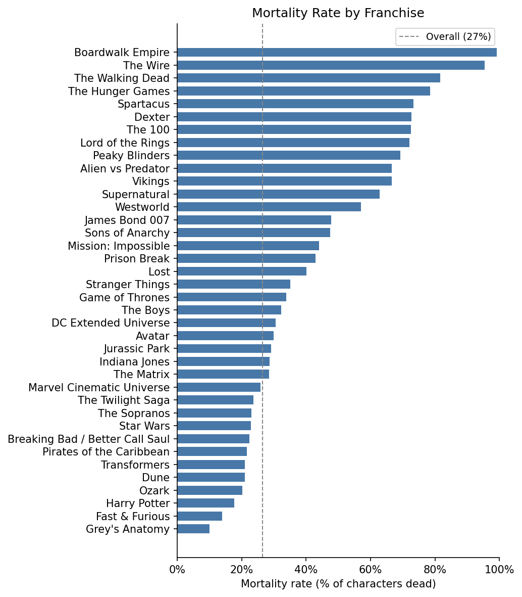
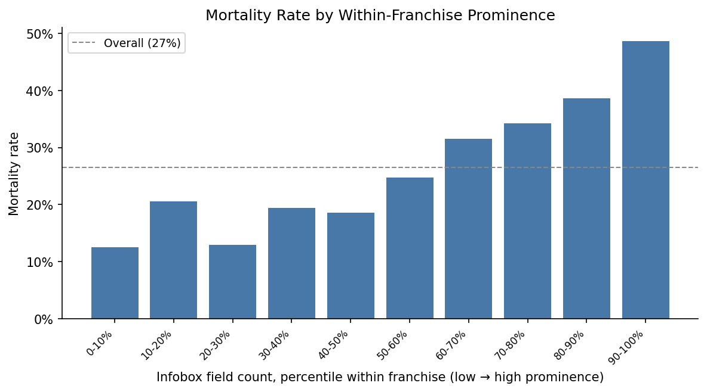
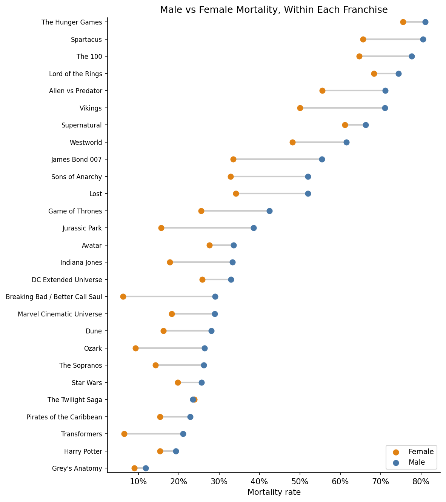
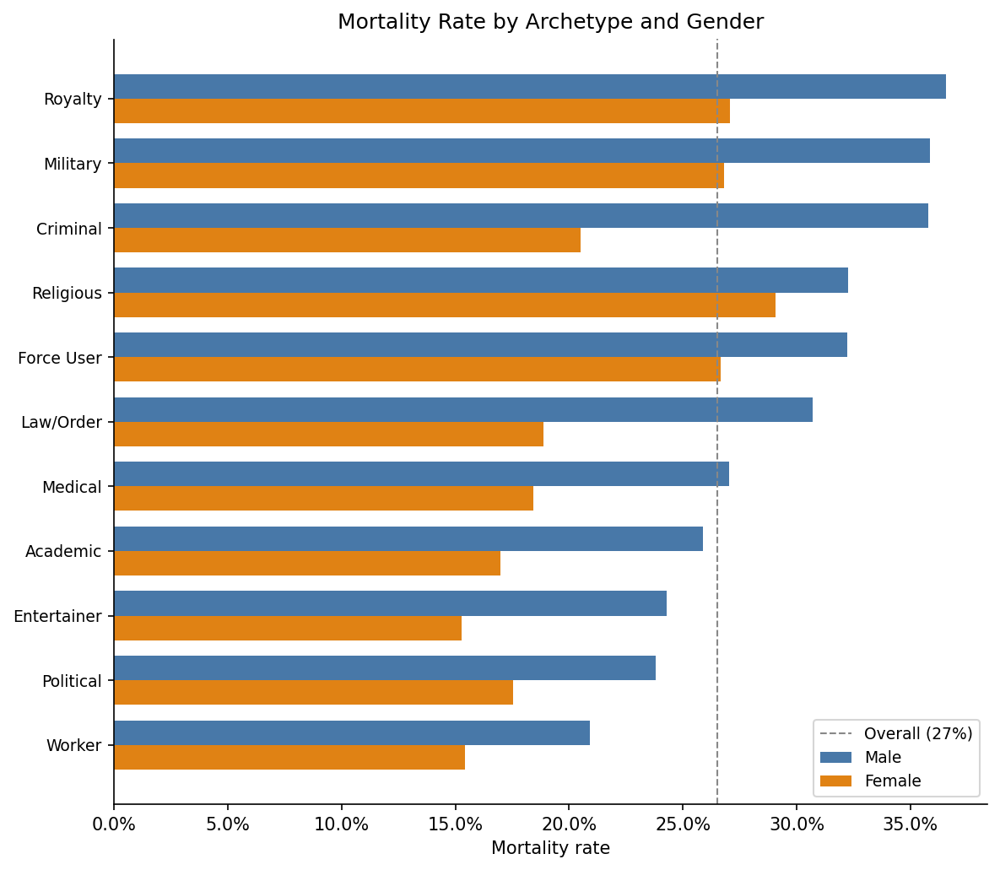

# Analysis Findings — Who Dies Next?

Working notes on what we found while exploring the dataset: how much data we
have, sanity checks, which features actually predict death, and a couple of
leakage traps we had to deal with. All numbers come from the scripts in this
folder (`feature_scan.py`, `text_leakage_check.py`, `text_features_clean.py`,
`social_scan.py`, `social_scan2.py`, and the plot scripts).

---

## 1. How much data

We ended up with 67,327 characters from 38 franchises, each labeled dead or
alive. About 27% of them are dead. The base came from scraping Fandom wikis,
and we joined in extra fields from a few public APIs and Kaggle datasets, so
each character has roughly 120 columns.

Worth flagging: Star Wars is by far the biggest wiki, so it alone is 42,271
rows — about 63% of the data. The next largest are Harry Potter (5,121), the
MCU (4,957), and Indiana Jones (2,134), and the rest trail off from there.
Because Star Wars is so dominant we plan to use franchise-stratified sampling
during modeling so it doesn't swamp the classifier.

---

## 2. Sanity checks

### Release years are all real
Before trusting `franchise_release_year`, we checked every franchise's value —
no zeros, no missing values, no impossible future dates. The years run from
1954 (Lord of the Rings) to 2019 (The Boys) with nothing out of range.

### Mortality by franchise matches each show's tone
If the labels are right, deadly shows should show high death rates. They do:
Boardwalk Empire 99%, The Wire 95%, The Walking Dead 82% at the top; Grey's
Anatomy 10%, Fast & Furious 14%, Harry Potter 18% at the bottom. Game of
Thrones sits mid-pack at ~34%. A few franchises (Peaky Blinders n=13, The
Matrix n=14) are too small to trust.

---

## 3. What predicts death (feature signal)

We scored every non-leaky feature by mutual information (MI) with `is_dead`
and a signed correlation for direction. Top structural/external features:

| feature | MI | corr |
|---|---|---|
| `infobox_field_count__frank_pct` | 0.086 | +0.262 |
| `appearance_count__frank_pct` | 0.039 | +0.064 |
| `franchise_female_ratio` | 0.035 | -0.065 |
| `franchise_size` | 0.035 | -0.116 |
| `page_text_length` | 0.033 | +0.084 |
| `fandom_category_count__frank_pct` | 0.032 | -0.008 |
| `franchise` (categorical) | 0.031 | — |
| `prominence_tier` | 0.020 | — |
| `genre` | 0.019 | — |

Two takeaways:

**Normalizing counts within a franchise is the big win.** Raw counts are
confounded by wiki style (some wikis just write longer pages). Ranking each
character against others in their own franchise fixes that:

| feature | raw MI | franchise-normalized MI |
|---|---|---|
| `infobox_field_count` | 0.031 | **0.086** (2.8x) |
| `appearance_count` | 0.004 | **0.039** (9x) |
| `fandom_category_count` | 0.000 | **0.032** (useless raw) |
| `page_text_length` | 0.033 | 0.030 (already fine) |

**Franchise itself matters less than expected.** As a category it only has
MI 0.031 — because Star Wars is 63% of the data and sits right at the base
rate (22.9% vs 26.5% overall). So most of the predictive work is *within*
franchises, not between them. (`franchise_size` and `franchise_female_ratio`
are basically franchise-identity proxies — better to replace with out-of-fold
target encoding than to feed raw.)

### Prominence is the strongest clean signal
Ranking `infobox_field_count` within franchise and splitting into ten groups,
death rate climbs from ~12% in the least-documented tenth to ~49% in the
most-documented tenth — nearly 4x.

---

## 4. Leakage traps

### The text "violence" feature mostly cheats
`violence_density` looked like the best feature of anything (MI 0.164,
corr +0.475). It isn't real. The lexicon counts words like *death, dead, die,
died, killed, murdered* over the full page — and a dead character's page says
those words *because they died*. Recomputing it cleanly:

| variant | corr | MI |
|---|---|---|
| original lexicon, full text | +0.475 | 0.164 |
| death words removed from lexicon | +0.165 | 0.029 |
| death sentences dropped first | +0.118 | 0.019 |

So ~85–90% of the signal was just the page announcing the death.

### All the keyword text features are weak once cleaned
After stripping death words and dropping death sentences, every lexicon
density lands in the MI 0.006–0.017 range — far below the structural features.
Not worth building the model around.

| feature | clean MI | clean corr |
|---|---|---|
| violence | 0.017 | +0.111 |
| conflict | 0.013 | +0.031 |
| vulnerability | 0.013 | +0.022 |
| leadership | 0.012 | +0.037 |
| villain | 0.012 | +0.020 |
| hero | 0.011 | -0.034 |
| power | 0.011 | +0.005 |
| family | 0.006 | +0.025 |

(All text features are still a draft and need this kind of check before use.)

---

## 5. Social factors

**How gender is assigned.** Where the infobox lists a gender we use it
directly. For the ~13% of characters missing it, we infer from pronoun counts
in the first 500 words of the page — at least two "he/him/his" and a clear
majority gives Male, the same for "she/her" gives Female, otherwise it stays
Other/Unknown.

### Men die more — everywhere
Raw: men 30.0% vs women 21.6%. More importantly it holds *within* franchises:
men die more in 26 of 27 franchises (only Twilight reverses, by 0.3pp), with a
mean within-franchise gap of +12.3 points. So it's a real pattern, not just
"action franchises happen to be male."

**How archetype is assigned.** There's no clean occupation column, so we build
one with a keyword rule. First we match the character's infobox title/
occupation against word lists per role (Military = soldier, sergeant, captain,
admiral…; Royalty = king, queen, prince…; Criminal = thief, gangster…). If the
title gives nothing, we fall back to scanning the first ~2000 characters of the
page with the same patterns and take the role with the most hits. It's rough —
about 28% of characters land in "Unknown" — but good enough to compare roles.

### Role matters too, and the gender gap holds inside every role
Archetypes order by deadliness — Military/Royalty/Criminal ~33% at the top,
Worker/Entertainer ~18% at the bottom — and within every single role men still
die more (gap +3 to +15 points, widest for Criminals).

### Smaller effects
- Alignment: villains die more than heroes (Evil > Good in 4/5 franchises with
  enough labels, mean +8.4 points), but only 5 franchises have the labels.
- `is_human`: humans 29% vs non-humans 25% — small.
- Family / marital / nobility fields: near-zero coverage, not usable.

---

## 6. Feature recommendations

**Build around (clean, generalizes across franchises):**
- within-franchise normalized counts: `infobox_field_count__frank_pct`,
  `appearance_count__frank_pct`, `fandom_category_count__frank_pct`,
  `page_text_length`
- `gender`
- `archetype`, `prominence_tier`, `genre`
- franchise via out-of-fold target encoding

**Skip:** the lexicon text features (all MI ≤ 0.017 after cleaning), and the
GoT/HP/LOTR/Dune-specific columns (0–6% coverage — noise for a global model).

**Hard-exclude as leaky:** `violence_*` as currently built, plus the known
ones (`has_dod`, `dod`, `has_death_section`, `info_completeness`, `hg_winner`,
and the Kaggle survival columns).
