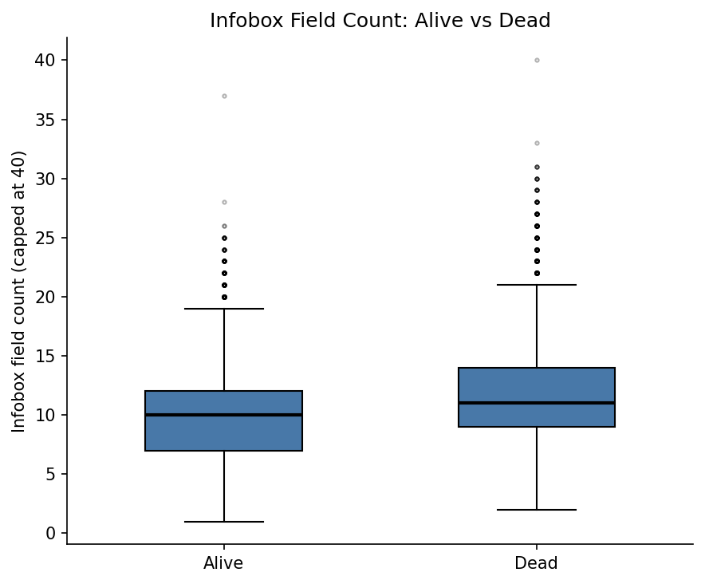

# Who Dies Next? Predicting Fictional Character Deaths Across Franchises

---

## Team Members

| Full Name | Teudat Zehut | CSE Username | Email |
|-----------|-------------|--------------|-------|
| [Name 1]  | [ID]        | [username]   | [email@cs.huji.ac.il] |
| [Name 2]  | [ID]        | [username]   | [email@cs.huji.ac.il] |
| [Name 3]  | [ID]        | [username]   | [email@cs.huji.ac.il] |

---

## Problem Description

Fictional character deaths are a central storytelling device — but they aren't random. Writers make deliberate choices about who lives and who dies based on a character's gender, prominence, role, and the franchise's genre and tone. We want to know: can we predict whether a fictional character dies, using only information available from their wiki page?

Our goal is to build a binary classifier that takes structured character metadata (gender, species, affiliation, wiki page length, infobox field count, franchise, content rating, etc.) and predicts `is_dead` (1 = dead, 0 = alive). Beyond the classifier itself, we're interested in which features are most predictive — whether death is driven more by who a character is, or by which franchise they belong to.

---

## Data

We scraped character data from 38 Fandom wikis (Game of Thrones, MCU, Star Wars, Harry Potter, Breaking Bad, and 33 others) using the MediaWiki API. For each character page, we extracted the structured infobox — the template that lists biographical fields like gender, species, affiliation, date of death, cause of death — and normalized these across franchises into a flat schema. Each character's `is_dead` label was inferred from their status field and the presence of a date-of-death entry.

We ended up with 67,327 characters from 38 franchises, each labeled dead or alive. About 27% of them are dead. The base came from scraping Fandom wikis, and we joined in extra fields from a few public APIs and Kaggle datasets, so each character has roughly 120 columns. Worth flagging: Star Wars is by far the biggest wiki, so it alone is 42,271 rows — about 63% of the data. The next largest are Harry Potter (5,121), the MCU (4,957), and Indiana Jones (2,134), and the remaining franchises trail off from there. Because Star Wars is so dominant we plan to use franchise-stratified sampling during modeling so it doesn't swamp the classifier.

---

## Reality Checks

### Check 1: Release years should all be real, sensible years

Before trusting `franchise_release_year` as a feature, we checked every franchise's release year to make sure nothing slipped through — no zeros, no missing values, no impossible future dates. Since release year is a franchise-level attribute, we plotted one point per franchise so any bad value would be obvious. The years run from 1954 (Lord of the Rings) to 2019 (The Boys), with no nulls and nothing out of range.

**Visualization: Release year per franchise (one point each)**

**Interpretation**: All 38 franchises land on sensible debut years with no outliers, so the field is clean. This passes the sanity check — we can use release year (and the decade/era features derived from it) without cleaning.

---

### Check 2: High-violence franchises should have higher mortality rates

We expected that franchises known for killing characters — The Walking Dead, Spartacus, Vikings — would show noticeably higher death rates than lighter franchises like the MCU or Harry Potter. If the label extraction worked correctly, franchise mortality rates should reflect the actual tone of each show.

**Visualization: Horizontal bar chart of mortality rate by franchise (sorted)**

**Interpretation**: Boardwalk Empire (99%), The Wire (95%), and The Walking Dead (82%) sit at the top, while Grey's Anatomy (10%), Fast & Furious (14%), and Harry Potter (18%) are at the bottom. Game of Thrones lands mid-pack at ~34% — lower than its reputation might suggest, likely because many minor background characters in our scrape are alive. This broadly matches expectations and gives us confidence the labels are sensible. (A few franchises like Peaky Blinders and The Matrix have very small samples, n=13 and n=14, so their rates are noisy.)

---

### Check 3: More prominent characters should die more — not less

Our initial instinct was that minor characters (short wiki pages, few infobox fields) die more often. In practice the opposite held: dead characters have a median of 11 infobox fields compared to 10 for living ones. This makes sense once you think about it — major characters are the ones whose deaths are dramatically meaningful, so they accumulate detailed wiki documentation precisely because their deaths were important enough to be fully recorded. We used `infobox_field_count` as a proxy for how thoroughly a character is documented on their Fandom wiki page.

**Visualization: Box plot of infobox field count, split by alive vs dead**

**Interpretation**: Dead characters have a slightly higher median infobox field count than living ones, which is the reverse of what we expected. The distributions overlap heavily, but the shift is consistent. It suggests that in our dataset, death is not a minor-character phenomenon — prominent, well-documented characters die too, arguably more so. This makes `infobox_field_count` a potentially useful feature for prediction, though the effect size is small.
