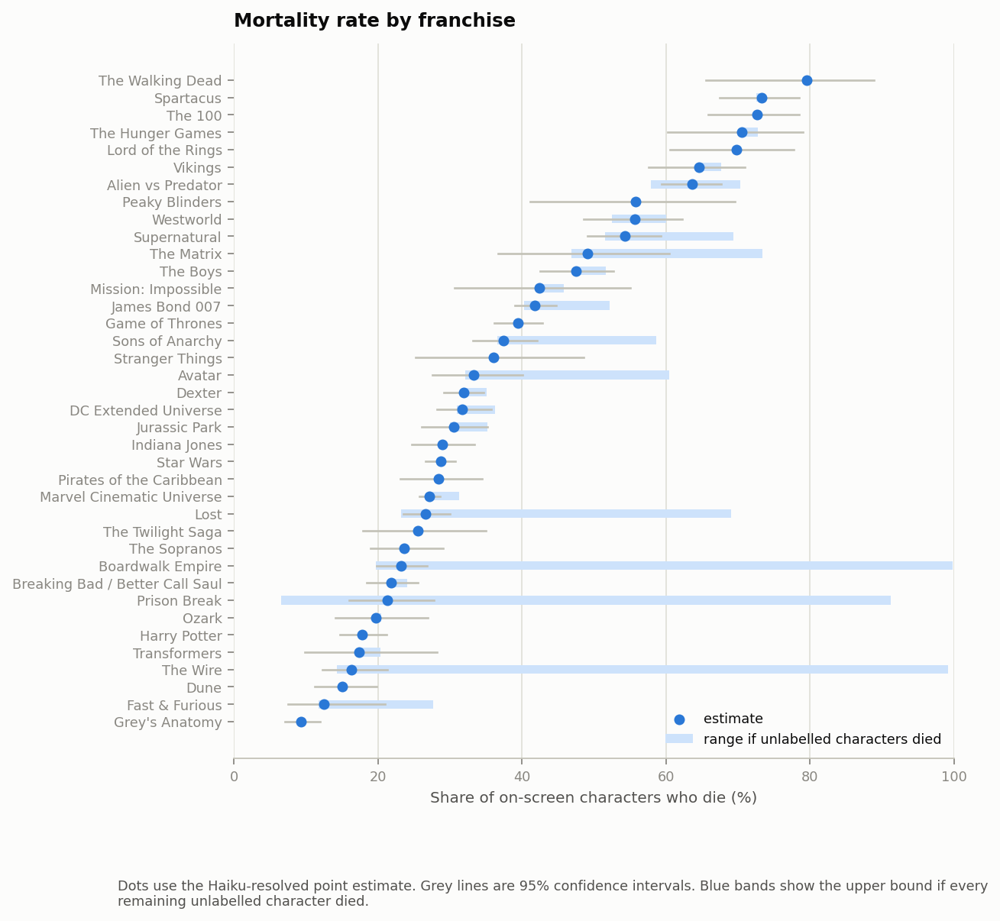
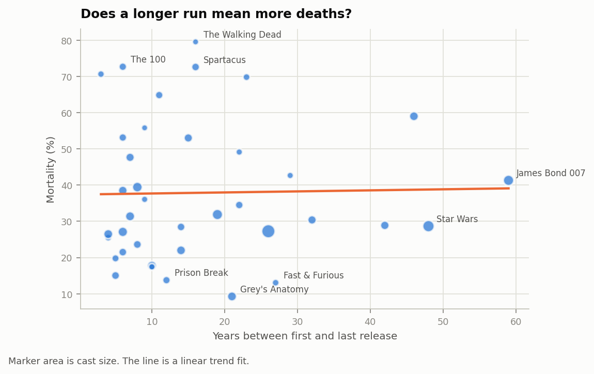
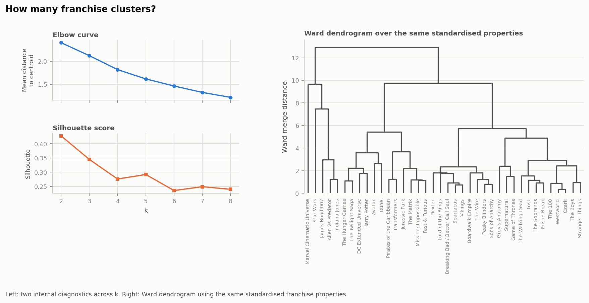

# A Needle in a Data Haystack (67978) - Final Project

# Spoiler Alert: Who Makes It to the Finale?

# Team members – Group #56

| Name | Email | CS ID |
| --- | --- | --- |
| Stav Abukarat | stav.abukarat@mail.huji.ac.il | stava |
| Shahar Spencer | shahar.spencer@mail.huji.ac.il | shahar.spencer |
| Bar Dalal | bar.dalal@mail.huji.ac.il | bar.dalal |
| Ido Oron | ido.oron@mail.huji.ac.il | ido_oron |

Demo: https://shaharspencer.github.io/needle-group-project/

# Domain

Our domain focuses on fictional characters in movies and TV franchises and their survival outcomes. We analyze this according to two levels. At the character level, we investigate whether a character's attributes and role predict their death better than the identity of their franchise. At the franchise level, we examine whether some franchises have higher mortality rates than others and whether factors such as genre, medium, rating, release year and run length help explain these differences.

# Data

We scraped 38 Fandom wikis covering major films and TV franchises - including Game of Thrones, Star Wars, the MCU, Harry Potter, and Breaking Bad. The raw scrape contains 68463 pages and about 262 MB of JSONL, one row per wiki page. We enriched this with cast and title metadata from TMDB (280 movies/TV titles across the 38 franchises, 28,151 cast credits, one row per actor's appearance in a title), used mainly for billing order (how prominently an actor is credited), title counts (how many movies/shows/seasons a franchise has), episode counts (how many episodes an actor appeared in), genre, and rating (TMDB's average user score for a title). We used two Kaggle death registries and “listofdeaths.fandom.com” sites only as validation sources for the death labels.
Each row represents one wiki page. The columns combine infobox fields, page and category metadata, TMDB cast information, text features, and graph measures. The main death label is built from infobox fields. 30 of the 38 wikis expose a status string, and eight mainly expose a date-of-death field instead. For the character-level analysis we drop characters whose death status can’t be parsed for either. For the franchise-level analysis, since missing death status is not evenly spread across franchises, dropping those characters would skew mortality rates for the franchises most affected. So we labelled 1,858 of these unclear/unlabeled cases with Claude Haiku 4.5 using a written rubric, a fixed set of instructions and edge-case rules we gave the model for deciding death status (with a "can't tell" option to prevent hallucinations). This added 123 dead, 1,223 alive, and 512 undecided labels.

# Label quality

We checked the death label two ways: reliability (does the rubric give the same answer twice) and correctness (is that answer right). We report Cohen's kappa rather than raw agreement, since, as the evaluation lecture notes, raw agreement overstates reliability when one class dominates, as it does here.

For reliability, we built a 600-page sample stratified across the two infobox formats and the outcome (dead, alive, or unparseable, "dropped"): 200 dropped-status pages, 150 dead/date-of-death pages, 100 dead/status pages, 75 alive/date-of-death pages, 75 alive/status pages. The 200 dropped pages had no parsed label at all, the same kind of case the Haiku fill resolves. The rubric asks an annotator to judge three things per page: whether it's an individual character, whether that character appears on screen, and whether they die in the story. We experimented with the rubric, revising it after an early pass left several edge cases unclear, especially historical figures played by actors inside a fictional story, then ran the final rubric twice, independently, on this sample. Kappa for death was 0.67. Raw agreement on death was 0.84.

For correctness, we checked two things. First, we compared the automatic, infobox-parsed death label against an independent annotator following the final rubric, blind to the automatic label: 0.65 kappa (n = 405). Second, we compared our death labels against 'listofdeaths.fandom.com', a registry from different editors: 197 of 202 matched Game of Thrones/The 100 characters had the same death label as ours. That registry only lists deaths, so it lets us check that characters who really died are labelled dead in our data.

# Data quality and filtering

The raw scrape contained many irrelevant entries. We filtered the dataset to include only pages naming an actor in the infobox or matching a TMDB cast credit. This rule flagged 16,808 of the 68,463 raw pages (24.6%) as on-screen. After rule-based removal of 168 objects (e.g. "Witch in portrait", a Harry Potter page about a talking painting, not a character) and 1,122 unnamed background roles, our final Q1 population comprises 15,686 named on-screen characters with a 35.6% mortality rate.

# Q1: Do character attributes predict death better than franchise identity? Problem description

This section investigates whether character mortality is primarily governed by character-level traits or dictated by franchise-specific properties. The fundamental challenge lies in generalization: a model that only memorizes franchise-level baseline death rates will fail entirely when predicting character survival in unseen stories or new media properties.

# Our solution

**Features.** We use four feature sources: franchise metadata, character attributes, a social-position graph, and wiki page text, combined into 12 feature sets. For social position, we built a per-franchise co-mention graph (an edge when one character's page text mentions another's name) and extracted PageRank, HITS, and degree. We used Louvain community detection over Girvan-Newman, which doesn't scale as well, finding stable communities (median modularity 0.426). We kept structural features like community size and embeddedness but excluded raw community IDs, which would let the model memorize franchise-specific groupings. TF-IDF text features use the 300 most frequent terms from wiki page text, with a minimum document frequency of 20, excluding sentences and vocabulary that leak death or survival. We rebuilt the vocabulary from scratch on the training rows of each fold, so test-set word choices never reached the model.

**Models.** We trained logistic regression, a decision tree, and a random forest on each feature set. All three use balanced class weights, since only 35.6% of characters die; without it, the model could get a good loss score by mostly predicting "alive." Logistic regression uses the default regularization for every feature set. We didn't tune it per feature set, since that would make it unclear whether a score difference came from the features or from extra tuning. The decision tree is pre-pruned (max depth 6, minimum 50 samples per leaf): without pruning, with 369 sparse one-hot columns, the tree splits on categories held by only a handful of characters, memorizing noise instead of a general pattern. We compared this against cost-complexity post-pruning and found it performed about the same; we used pre-pruning for the reported results. The random forest uses 400 trees; we tested larger forests and the score stopped improving past that point.

For the headline results, we selected the winning model automatically: five-fold CV PR-AUC on the training portion across all 36 combinations (3 models × 12 feature sets), refit on the full training portion, then scored once on the held-out test set (see Setup). The winner was the random forest on the full feature set, in both the random and grouped splits, so every test-set number in Results uses that model.

# Evaluation criteria

PR-AUC (area under the precision-recall curve) summarizes how well the model ranks true deaths above survivors across every threshold. Only 35.6% of characters die, so a classifier guessing randomly scores about that rate by chance, 0.356 PR-AUC is the score to beat. We use PR-AUC as our main metric because it's more sensitive than accuracy or ROC-AUC to minority-class performance, and death is the minority class here. Accuracy doesn't work well: guessing "alive" for everyone already reaches 64.4%. We report ROC-AUC, the area under the curve of true-positive rate against false-positive rate across every threshold, as a secondary metric.

# Setup

Franchise distribution remained uneven after filtering (e.g., Star Wars dropped from 56% to 12% of the corpus), so we ran two cross-validation settings on all 15686 Q1 characters. In random 5-fold CV, characters from the same franchise can appear in both train and validation folds. In grouped 5-fold CV, 'GroupKFold' holds out whole franchises. The grouped setting asks whether the model transfers to a franchise it has never seen. For the final evaluation, we made separate random and franchise-grouped 80/20 splits. Within each 80% training portion, we selected the model using five-fold cross-validation, refitted it on the full training portion, and evaluated it once on the untouched 20% test set.

# Results

Character attributes beat franchise identity on their own: 0.633 PR-AUC versus 0.556 under random CV. Combining them improves the score further. The full model reaches 0.744 under random CV, but drops by 0.189 under grouped CV. That drop is the main warning sign. A large part of the random-CV score comes from information that does not transfer cleanly across franchises.

: feature set vs PR-AUC. Figure 3 compares all 12 feature-set combinations built from the four sources above (franchise metadata, character attributes, graph centrality, community structure), individually and combined, against the 0.356 PR-AUC baseline. Franchise identity is especially weak under grouped CV, where it falls to 0.398 PR-AUC, barely above that baseline. For an unseen franchise, the one-hot franchise column is all zeros, so the model is left with only coarse metadata such as genre, medium, rating, and year.

Community features add 0.024 over character attributes alone, but only 0.004 once centrality is already included. We also compared every feature set against character-only across the same five folds. Random folds vary little between runs (0.009 to 0.013 PR-AUC); grouped folds vary much more (0.034 to 0.082), often more than the gap between feature sets, so we treat small feature-set differences under grouped CV cautiously.

: feature set vs fold-level PR-AUC. Figure 4 shows PR-AUC for each feature set across the five CV folds individually, small dots per fold and a large dot for the mean, random and grouped regimes on the same scale, to show how much fold-to-fold variation there is relative to the differences between feature sets.

The strongest mean paired improvements over character-only are the all-feature model (+0.077 grouped, 5/5 folds; +0.111 random, 5/5) and character+text (+0.051 grouped, 5/5). Network and community variants are less stable under grouped CV, usually winning only three folds out of five. Community-only and franchise-only are both worse than character-only under grouped CV. We separately tested whether deaths are concentrated within graph communities, even though community features add little to the classifier. For each franchise we computed: 'D = P(same fate | same community) - P(same fate | different community)' We compared D to 2,000 within-franchise label shuffles, keeping the graph and the franchise death rate fixed. Five franchises had too few characters or communities for this test, leaving 33. Thirteen franchises exceeded the one-sided null at p < 0.05. The largest effects were in serialised drama: Lost (D = 0.109, z = 15.1), the Breaking Bad universe (D = 0.115, z = 9.3), Dune, Game of Thrones, and The 100. The cast-weighted mean D across all franchises was only +0.012, so this is not a universal effect.

: franchise vs fate concentration. Figure 5's left panel ranks all 33 testable franchises by fate concentration (D, standardised against the label-shuffling null), with a significance line at p = 0.05; the right panel plots that same concentration against each franchise's community-partition strength (modularity Q).

The one-sided test only flags positive clustering. Four franchises, the MCU, Grey's Anatomy, Ozark, and Spartacus, had z-scores below -2.3, meaning same-fate pairs were less concentrated within communities than expected. We did not apply a multiple-comparisons correction across the 33 tests, and Supernatural was one of the positive franchises despite having low modularity (Q = 0.234). We treat the community-death relationship as visible in some franchises, but not stable enough to generalize.

On the held-out test split, the all-feature random forest scored 0.756 PR-AUC / 0.849 ROC-AUC under a random split and 0.667 / 0.772 when whole franchises were held out. Both are above the corresponding CV estimates. With only 38 franchises, the grouped result still depends heavily on which franchises land in the held-out set. Permutation importance on the character-only forest ranks page length first (0.167), then archetype (0.111), gender (0.107), infobox field count (0.101, with death-revealing fields like a listed date of death removed to prevent leakage), prominence tier (0.101), and billing order (0.092). The top features are partly measurements of wiki attention rather than properties of the character. We computed permutation importance on the training data, so the reported drops are likely optimistic. We therefore use the ranking only as a rough indication of which features the model relies on.

: feature vs permutation-importance drop. Figure 6 ranks character attributes by permutation importance for the character-only random forest, with wiki-derived metadata features marked separately from genuine character attributes.

For gender, we fit an adjusted model. Women have about half the odds of dying compared with men (OR 0.564, 95% CI 0.516 to 0.616), after adjusting for billing order, archetype, alignment, human/nonhuman status, and franchise. The unadjusted gap is 14.5 percentage points; the adjusted gap is about 11.1 points. None of the 22 franchises where the franchise-specific effect was estimable reversed direction.

: franchise vs gender odds ratio. Figure 7 plots the adjusted odds ratio for dying, women vs. men, per franchise, with 95% confidence intervals; filled points are significant at p < 0.05.

# Impediments

The biggest modelling issue is that prediction cost depends on the use case: is a false spoiler (false positive) worse than a missed death (false negative), or the other way around? Picking a single threshold like 0.5 only makes sense if the two errors cost the same. Following the evaluation lecture's weighted-loss approach, we instead scored thresholds using `w1 * FN + FP`, where `w1` is the cost of one missed death relative to one false alarm, swept over a range (`w1` = 0.5, 1, 2, 3, 5, 10) so a reader who disagrees with our assumption can read off their own threshold. The best global threshold ranges from 0.80 at the low end (`w1 = 0.5`) to 0.13 at the high end (`w1 = 10`).

: threshold vs weighted loss. Figure 8 plots weighted loss against decision threshold for each assumed cost ratio w1, with a dot marking each curve's minimum.

The errors are also franchise-specific. Here, the worst 100 are the rows with the largest absolute difference between the predicted probability and the true label. Spartacus contributes 13% of them while making up only 1.5% of the data. All 13 are false positives, despite the franchise's 73.4% mortality rate. Grey's Anatomy is overrepresented by a factor of 2.6, with nine false negatives among the worst 100 errors. At a representative `w1 = 3` from that same sweep, the best franchise-specific threshold is 0.05 for Spartacus and 0.64 for Grey's Anatomy. We did not use franchise-specific thresholds in the main model because they require labelled examples from the target franchise, which grouped CV deliberately withholds.

# Q2: Are some franchises deadlier? Problem description

For Q2, the unit of analysis is the franchise. We estimate each franchise's mortality rate and test whether observable franchise properties explain the differences. We also cluster franchises using non-mortality properties and check whether the resulting groups differ in mortality.

# Our solution

**Regression.** Death is a yes/no outcome, so our first approach was the natural one: logistic regression (a binomial generalized linear model, or GLM) fit at the character level, predicting each character's death from their franchise's properties and treating each character as an independent observation. This produced massive overdispersion: characters in the same franchise aren't independent, they share whatever's true about their franchise. So we collapsed the data into 38 franchise-level rows instead, regressing logit(mortality) on franchise properties, weighted by cast size so bigger franchises count for more. Future work could use mixed-effects models to keep character-level data without this problem. We measured run span from each franchise's first and last release date, to separate long-running TV shows from single or few-film franchises. With only 38 rows, p-values here are noisy, so we treat any single result cautiously.

**Clustering.** We standardized eight franchise properties (cast size, gender ratio, number of titles, TV-vs-film split, first release year, run span, average rating, average popularity) and left mortality out, so the groupings can't be built from the outcome we later compare them against. Following the clustering lecture, we applied k-means++ with ten seeds to reduce initialization sensitivity, then chose the number of clusters using the standard silhouette-score and elbow-curve heuristics.

# Evaluation criteria

For the regression, a franchise property counts as explanatory only if two things hold: it's significant at p < 0.05 with the franchise as the unit of analysis, and adding it improves adjusted R-squared over a mean-only baseline (a model that just predicts the same average mortality rate for every franchise).

For clustering, we check three things. First, internal validation: how tight and well-separated the clusters are (cohesion and separation, from the clustering lecture), plus the standard silhouette score and agreement with Ward agglomerative clustering. Second, an external check: whether the clusters differ in mortality, an outcome we didn't use to build them. Third, we report purity and entropy against medium (film vs. TV), but treat that as a weak check since medium is partly recoverable from the same features we clustered on: TV franchises tend to have more titles and a longer run span than film franchises, so a cluster built on those features can end up separating TV from film even without being told medium directly.

# Setup

The Q2 population is 17,584 named on-screen characters, larger than Q1's 15,686. Q1 drops characters whose death status can't be parsed; Q2 keeps them, since dropping them here would distort franchise-level mortality rates rather than just shrink the sample.

Four franchises have unusually many characters with unparseable status, so many that just dropping those characters (as Q1 does) would badly bias their mortality rate rather than merely shrink the sample. For example, The Wire's rate could be anywhere from 14.3% to 99.2% depending on what those characters' true fates are, too wide a range to collapse into one silently-chosen number. So for these four, instead of reporting one number, we report three: a lower bound (assume every unparseable character survived), an upper bound (assume they all died), and a point estimate, our best single guess, using the Haiku-resolved labels rather than either extreme.

All rates use Wilson intervals, a standard way to compute a confidence interval for a proportion that stays reliable even with a small sample or a rate near 0% or 100%.

# Results

Among the 25 franchises with at least 50 characters and at least 90% status coverage, mortality ranges from 9.3% for Grey's Anatomy to 72.6% for the 100. The Walking Dead reaches 79.5%, but it has only 44 characters in our filtered data.

: franchise vs mortality rate. Figure 9 shows all 38 franchises sorted by mortality rate, dots for the point estimate, grey lines for the 95% confidence interval, and blue bands for the four low-coverage franchises showing the upper bound if every unparseable character actually died.

None of the tested franchise properties are significant in the collapsed regression. Run span is closest, with p = 0.185. The model R-squared is 0.079 and adjusted R-squared is -0.065. The predictors explain little variation and do not improve on the mean-only model once their number is considered. The four lowest-coverage franchises have the widest bounds. The Wire ranges from 14.3% to 99.2% using infobox evidence alone, with a Haiku-assisted point estimate of 16.3%. Lost ranges from 23.2% to 69.0%, with a point estimate of 26.6%. We show these rows to make the uncertainty visible, but do not use them as strong evidence for comparisons.

: run span vs mortality rate. Figure 10 plots each franchise's run span (years between its first and last release) against its mortality rate, marker size proportional to cast size, with a linear trend line.

The silhouette score peaks at k = 2 (0.428), while the elbow curve does not support a clear k: average distance to centroid falls smoothly from 2.41 at k = 2 to 1.21 at k = 8, with no sharp bend. Across ten seeds, 92.5% of franchise pairs were assigned to the same cluster together every time, so whichever k we pick, the partition itself is stable.

: number of clusters vs internal clustering diagnostics. Figure 11's left panels show the elbow curve and silhouette score across k; the right panel is a Ward dendrogram of the same standardised franchise properties.

At k = 2, the mean distance within clusters is 2.82 and the mean distance between clusters is 5.60, a ratio of 1.98. Using the clustering lecture's cluster-correlation measure, the correlation between distance and same-cluster membership is -0.65, as same-cluster pairs tend to be closer. Ward agglomerative clustering cut at k = 2 agrees with k-means on 94.7% of franchise pairs. At k = 2, six large, multi-title film franchises are separated from the other 32 franchises. Their mortality rates are 35.4% and 37.1%, an observed difference of 1.7 percentage points. Purity against medium is 0.684 and entropy is 0.804, but this is a weak external check because title count and related variables already distinguish film franchises.

# Impediments

Q2 is limited by the small number of franchises. Once the analysis is collapsed to one row per franchise, we have only 38 observations. This removes the spuriously small p-values from the character-level model, but also makes moderate effects difficult to detect. The second limitation is label coverage. Four franchises have particularly weak parsed status fields, so we report ranges rather than single estimates. Re-scraping the same wikis would not solve this because the fields are missing or inconsistent at the source.

# Interactive demo

The demo, **Plot Armor Index**, is available at: https://shaharspencer.github.io/needle-group-project/

The demo runs a browser-only logistic regression with fewer features than the full Q1 model, so it can run locally in the browser. One tab looks up a held-out test character and breaks down the score by feature. The other lets the user build a character manually and see how the predicted risk changes.

# Future work

Our first priority would be human double-coding of the 600-page label sample. On the modelling side, we would add features available partway through a story, train for unequal error costs, and test overlapping communities. We also collected 1,136 episode transcripts, unused in this analysis since dialogue isn't attributed to a speaker; speaker attribution would make them usable. A mixed-effects or quasibinomial model would also be a better fit for the franchise analysis than the collapsed regression we used.

# Conclusion

Character-level information predicts death better than franchise identity: 0.633 PR-AUC versus 0.556 under random CV, with a 0.356 base rate. The all-feature model reaches 0.756 PR-AUC and 0.849 ROC-AUC on the held-out random test split, and 0.667 / 0.772 when whole franchises are held out. Text is the most useful single addition to character attributes under grouped CV (+0.051 PR-AUC), while network and community features are smaller and less stable. At the franchise level, mortality varies a lot, but the properties we tested do not explain that variation. The collapsed regression has negative adjusted R-squared, and the k = 2 franchise clustering separates large film franchises from the rest without separating mortality. Our main caveat is that the best predictive features are also the most suspicious ones. Page length and infobox field count partly measure fan attention, and fan attention is affected by the character's full story. We used grouped cross-validation, leakage checks, and external label validation to avoid mistaking wiki-writing patterns for a model of character death.
