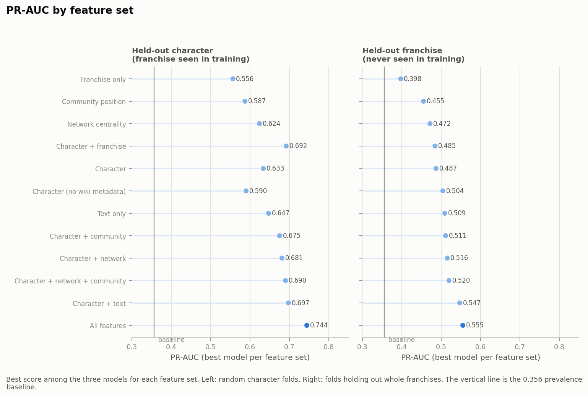
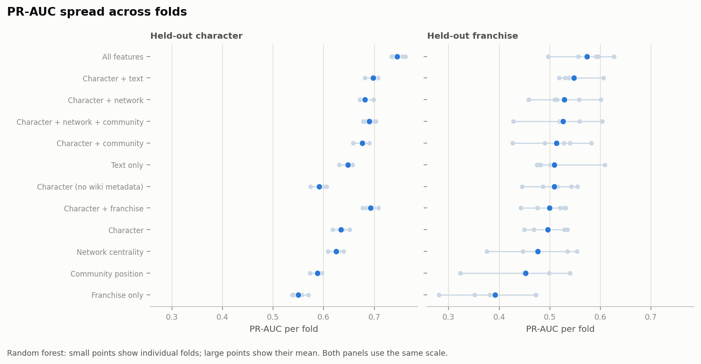
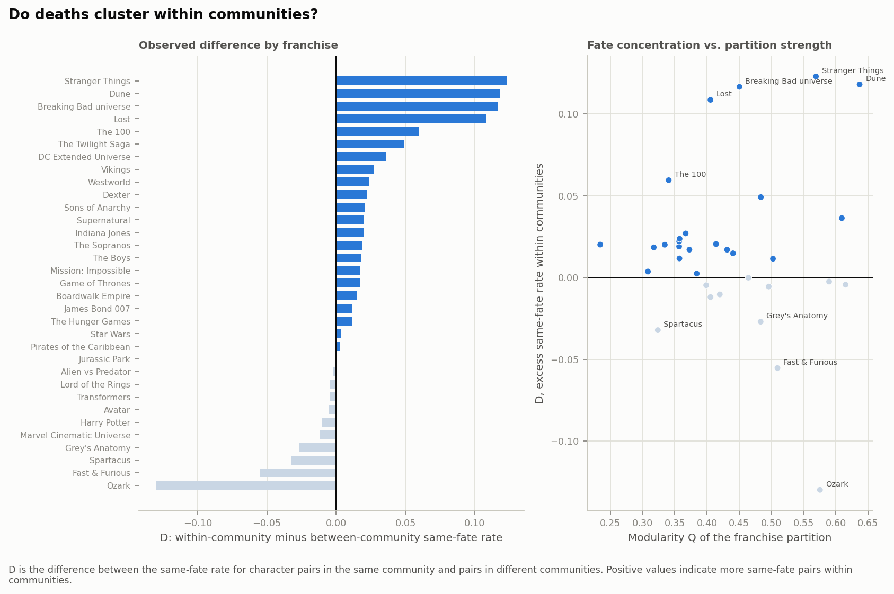
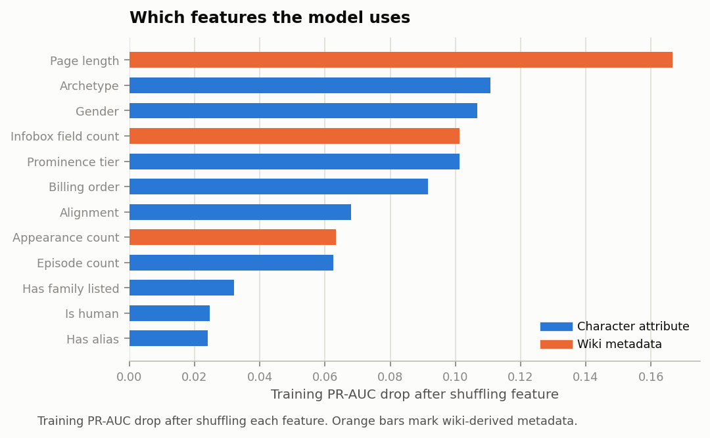
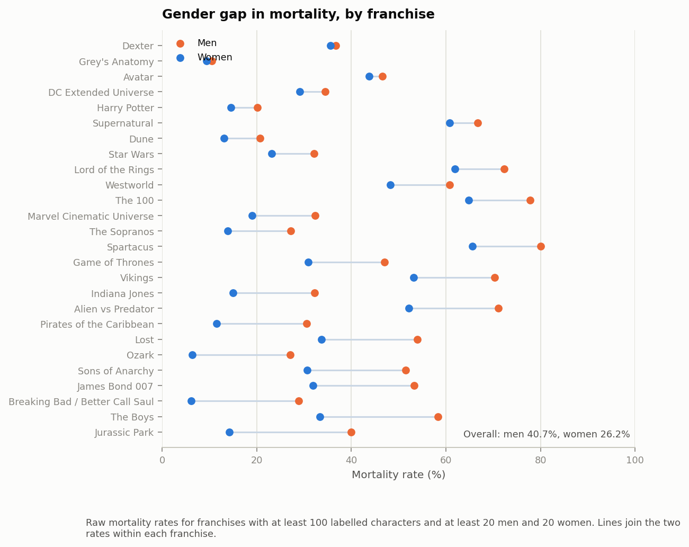
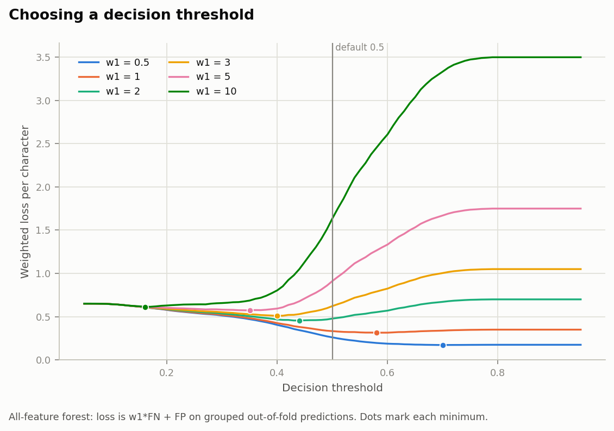
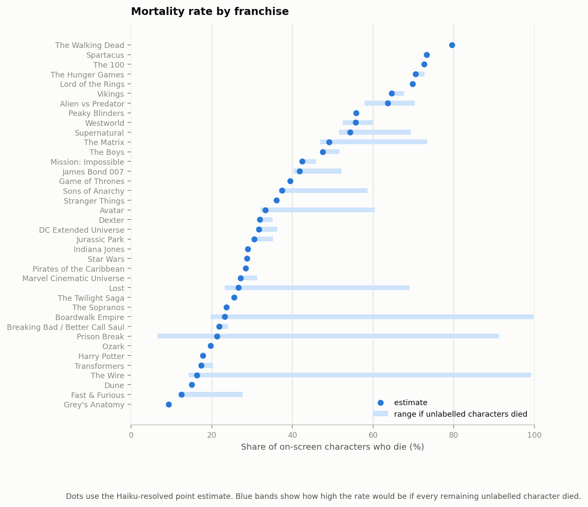
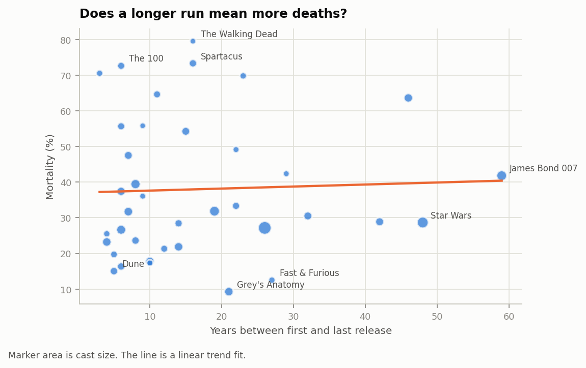
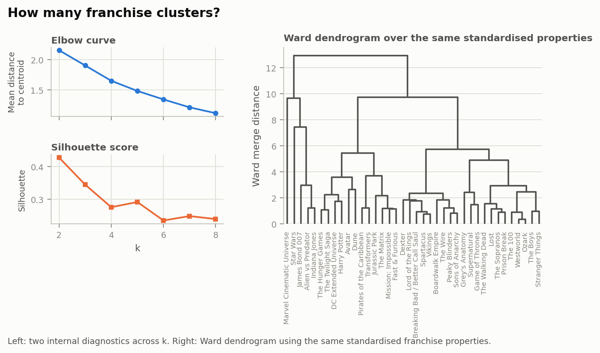

# A Needle in a Data Haystack (67978) - Final Project

# Spoiler Alert: Who Makes It to the Finale?

# Team members – Group #56

| Name | Email | CS ID |
| --- | --- | --- |
| Stav Abukarat | stav.abukarat@mail.huji.ac.il | stava |
| Shahar Spencer | shahar.spencer@mail.huji.ac.il | shahar.spencer |
| Bar Dalal | bar.dalal@mail.huji.ac.il | bar.dalal |
| Ido Oron | ido.oron@mail.huji.ac.il | ido_oron |

Demo: https://shaharspencer.github.io/needle-group-project/

Repository: https://github.com/shaharspencer/needle-group-project/

Data: https://github.com/shaharspencer/needle-group-project/blob/master/data/README.md

# Domain

Our domain focuses on fictional characters in movies and TV franchises and their survival outcomes. We analyze this at two levels. At the character level, we investigate whether a character's attributes and role predict their death better than the identity of their franchise. At the franchise level, we examine whether some franchises have higher mortality rates than others and whether factors such as genre, medium, rating, release year and run length help explain these differences.

# Data

We scraped 38 Fandom wikis covering major films and TV franchises - including Game of Thrones, Star Wars, the MCU, Harry Potter, and Breaking Bad. After compiling the scrape, the main character table contains 68,463 wiki pages, one row per page. We enriched this with cast and title metadata from TMDB (280 movies/TV titles across the 38 franchises, 28,151 cast credits, one row per actor's appearance in a title), used mainly for billing order (how prominently an actor is credited), title counts (how many movies/shows/seasons a franchise has), episode counts (how many episodes an actor appeared in), genre, and rating (TMDB's average user score for a title). We used two Kaggle death registries and “listofdeaths.fandom.com” sites only as validation sources for the death labels.
Each row represents one wiki page. The columns combine infobox fields, page and category metadata, TMDB cast information, text features, and graph measures. The main death label is built from infobox fields. 30 of the 38 wikis expose a status string, and eight mainly expose a date-of-death field instead. For the character-level analysis we drop characters whose death status can’t be parsed for either. For the franchise-level analysis, since missing death status is not evenly spread across franchises, dropping those characters would skew mortality rates for the franchises most affected. So we labelled 1,858 of these unclear/unlabeled cases with Claude Haiku 4.5 using a written rubric, a fixed set of instructions and edge-case rules we gave the model for deciding death status (with a "can't tell" option for unclear cases). This added 123 dead, 1,223 alive, and 512 undecided labels.

# Label quality

We checked the death label in two ways: repeatability between runs and agreement with other label sources. We report Cohen's kappa rather than raw agreement, since, as the evaluation lecture notes, raw agreement overstates reliability when one class dominates, as it does here.

For reliability, we built a 600-page sample stratified across the two infobox formats and the outcome (dead, alive, or unparseable, "dropped"): 200 dropped-status pages, 150 dead/date-of-death pages, 100 dead/status pages, 75 alive/date-of-death pages, 75 alive/status pages. The 200 dropped pages had no parsed label at all, the same kind of case the Haiku fill resolves. The rubric asks whether each page describes an individual character, whether that character appears on screen, and whether they die in the story. After revising unclear edge cases, we applied the final rubric twice using separate Claude Haiku 4.5 runs. Kappa for death was 0.67 and raw agreement was 0.84. These numbers measure the repeatability of our model-assisted labelling process, not agreement between human annotators.

For agreement with other labels, we checked two things. First, we compared the automatic, infobox-parsed death label against a separate Haiku annotation run that did not see the automatic label: 0.65 kappa (n = 405). Second, we compared our death labels against 'listofdeaths.fandom.com', a human-edited registry: 197 of 202 matched Game of Thrones/The 100 characters had the same death label as ours. That registry only lists deaths, so it checks whether characters known to have died are labelled dead in our data.

# Data quality and filtering

The raw scrape contained many irrelevant entries. We filtered the dataset to include only pages naming an actor in the infobox or matching a TMDB cast credit. This rule flagged 16,808 of the 68,463 raw pages (24.6%) as on-screen. After rule-based removal of 168 objects (e.g. "Witch in portrait", a Harry Potter page about a talking painting, not a character) and 1,122 unnamed background roles, our final Q1 population comprises 15,686 named on-screen characters with a 35.6% mortality rate.

# Q1: Do character attributes predict death better than franchise identity? Problem description

We test whether character attributes or franchise identity are better predictors of death. A model that only learns each franchise's death rate may not work for a franchise it has never seen.

# Our solution

**Features.** We use four feature sources: franchise metadata, character attributes, a social-position graph, and wiki page text, combined into 12 feature sets. For social position, we built a per-franchise co-mention graph (an edge when one character's page text mentions another's name) and extracted PageRank, HITS, and degree. We used Louvain community detection instead of Girvan-Newman, which doesn't scale as well; the median modularity was 0.426. We kept structural features such as community size and the share of a character's links within their community, but excluded raw community IDs, which would let the model memorize franchise-specific groupings. TF-IDF text features use the 300 most frequent terms from wiki page text and ignore terms appearing in fewer than 20 pages. This keeps the text block similar in size to the structured feature block and removes very rare words. We excluded sentences and vocabulary that leak death or survival. We rebuilt the vocabulary from scratch on the training rows of each fold, so test-set word choices never reached the model.

**Models.** We trained logistic regression, a decision tree, and a random forest on each feature set. All three use balanced class weights so mistakes on the smaller dead class are not overlooked. Logistic regression uses the default regularization for every feature set. We didn't tune it per feature set, since that would make it unclear whether a score difference came from the features or from extra tuning. The decision tree is pre-pruned (max depth 6, minimum 50 samples per leaf): without pruning, with 369 sparse one-hot columns, the tree splits on categories held by only a handful of characters, memorizing noise instead of a general pattern. We compared this against cost-complexity post-pruning and found it performed about the same; we used pre-pruning for the reported results. The random forest uses 400 trees; we tested larger forests and the score stopped improving past that point.

We selected the best model using five-fold CV PR-AUC on the training portion across all 36 combinations (3 models × 12 feature sets). We then refit it on the full training portion and scored it once on the held-out test set (see Setup). The random forest with all features won under both the random and grouped splits, so the test results below use that model.

# Evaluation criteria

PR-AUC (area under the precision-recall curve) summarizes how well the model ranks true deaths above survivors across every threshold. Only 35.6% of characters die, so a classifier guessing randomly scores about that rate by chance, 0.356 PR-AUC is the score to beat. We use PR-AUC as our main metric because it's more sensitive than accuracy or ROC-AUC to minority-class performance, and death is the minority class here. Accuracy doesn't work well: guessing "alive" for everyone already reaches 64.4%. We report ROC-AUC, the area under the curve of true-positive rate against false-positive rate across every threshold, as a secondary metric.

# Setup

Franchise distribution remained uneven after filtering (e.g., Star Wars dropped from 56% to 12% of the corpus), so we ran two cross-validation settings on all 15686 Q1 characters. In random 5-fold CV, characters from the same franchise can appear in both train and validation folds. In grouped 5-fold CV, 'GroupKFold' holds out whole franchises. The grouped setting asks whether the model transfers to a franchise it has never seen. For the final evaluation, we made separate random and franchise-grouped 80/20 splits. Within each 80% training portion, we selected the model using five-fold cross-validation, refitted it on the full training portion, and evaluated it once on the untouched 20% test set.

# Results

Character attributes beat franchise identity on their own: 0.633 PR-AUC versus 0.556 under random CV. Combining them improves the score further. The full model reaches 0.744 under random CV, but drops by 0.189 under grouped CV. That drop is the main warning sign. A large part of the random-CV score comes from information that does not transfer cleanly across franchises. Franchise identity is especially weak under grouped CV, where it falls to 0.398 PR-AUC, barely above the 0.356 baseline (Figure 3): for an unseen franchise, the one-hot franchise column is all zeros, so the model is left with only coarse metadata such as genre, medium, rating, and year.

Community features add 0.024 over character attributes alone, but only 0.004 once centrality is already included. We also compared every feature set against character-only across the same five folds. The standard deviation across random folds is only 0.009 to 0.013 PR-AUC, while across grouped folds it is 0.034 to 0.082. This is often larger than the gap between feature sets, so we treat small differences under grouped CV cautiously (Figure 4).

The strongest mean improvements over character-only are the all-feature model (+0.077 grouped, 5/5 folds; +0.111 random, 5/5) and character+text (+0.051 grouped, 5/5). Network and community variants usually win only three grouped folds out of five. Community-only and franchise-only are both worse than character-only under grouped CV. For the 33 franchises with at least 100 characters and two communities, we also calculated D, the difference between the same-fate rate for pairs in the same community and pairs in different communities. D is largest for Stranger Things (0.123), Dune (0.118), the Breaking Bad universe (0.116), and Lost (0.109). The cast-weighted mean across all franchises is only +0.012, so the descriptive relationship is small overall (Figure 5).

On the held-out test split, the all-feature random forest scored 0.756 PR-AUC / 0.849 ROC-AUC under a random split and 0.667 / 0.772 when whole franchises were held out. Both are above the corresponding CV estimates. With only 38 franchises, the grouped result still depends heavily on which franchises land in the held-out set. To see which character features the model uses, we shuffled one feature at a time and measured the drop in training PR-AUC. Page length caused the largest drop (0.167), followed by archetype (0.111), gender (0.107), infobox field count (0.101, with death-revealing fields such as a listed date of death removed), prominence tier (0.101), and billing order (0.092) (Figure 6). Some of these features measure wiki attention rather than properties of the character. Because this check uses the training data, we treat the ranking only as a rough indication.

Among characters with a recorded male or female gender, 40.7% of men and 26.2% of women die, a raw difference of 14.5 percentage points. Figure 7 shows the same descriptive comparison within each franchise that has enough characters from both groups. This comparison does not adjust for differences in role or prominence.

# Visualization

Figure 3 compares all 12 feature sets, built from franchise metadata, character attributes, wiki text, graph centrality, and community structure, against the 0.356 PR-AUC baseline under random and grouped CV.

Figure 4 plots random-forest PR-AUC for each feature set across the five CV folds, individually and as a mean, with the random and grouped settings on the same scale.

Figure 5's left panel ranks the 33 testable franchises by D, the difference between within-community and between-community same-fate rates. The right panel plots D against each franchise's modularity Q.

Figure 6 shows how much the character-only random forest's training PR-AUC falls when each feature is shuffled. Wiki-derived metadata features are marked separately from character attributes.

Figure 7 compares the raw male and female mortality rates within franchises with at least 100 labelled characters and at least 20 characters from each gender.

Figure 8, referenced in Impediments below, plots weighted loss against decision threshold for each assumed cost ratio w1, with a dot marking each curve's minimum.

# Impediments

The biggest modelling issue is that prediction cost depends on the use case: is a false spoiler (false positive) worse than a missed death (false negative), or the other way around? Picking a single threshold like 0.5 only makes sense if the two errors cost the same. Following the evaluation lecture's weighted-loss approach, we scored the all-feature forest's grouped out-of-fold predictions using `w1 * FN + FP`, where `w1` is the cost of one missed death relative to one false alarm. We swept over a range (`w1` = 0.5, 1, 2, 3, 5, 10) so a reader who disagrees with our assumption can read off their own threshold. The best global threshold ranges from 0.70 at the low end (`w1 = 0.5`) to 0.16 at the high end (`w1 = 10`, Figure 8).

The errors are also franchise-specific. Here, the worst 100 are the rows with the largest absolute difference between the predicted probability and the true label. Spartacus contributes 13% of them while making up only 1.5% of the data. All 13 are false positives, despite the franchise's 73.4% mortality rate. Grey's Anatomy is overrepresented by a factor of 2.6, with nine false negatives among the worst 100 errors. At a representative `w1 = 3` from that same sweep, the best franchise-specific threshold is 0.20 for Spartacus and 0.64 for Grey's Anatomy. We did not use franchise-specific thresholds in the main model because they require labelled examples from the target franchise, which grouped CV deliberately withholds.

# Q2: Are some franchises deadlier? Problem description

For Q2, the unit of analysis is the franchise. We estimate each franchise's mortality rate and check whether observable franchise properties explain the differences. We also cluster franchises using non-mortality properties and check whether the resulting groups differ in mortality.

# Our solution

**Regression.** We reduced the data to one row per franchise and fitted an ordinary linear regression to the franchise mortality rates. The predictors are medium, first release year, number of titles, run span, and average rating. We measured run span from each franchise's first and last release date. With only 38 franchises, we interpret the R-squared and fitted coefficients cautiously.

**Clustering.** We standardized eight franchise properties (cast size, gender ratio, number of titles, TV-vs-film split, first release year, run span, average rating, average popularity) and left mortality out. We applied k-means++ as covered in the clustering lecture, using ten seeds to reduce sensitivity to the initial centres. We chose the number of clusters using two common additional checks: the silhouette score and elbow curve.

# Evaluation criteria

For the regression, we use R-squared to measure how much of the difference in mortality between franchises is explained by the tested properties. A mean-only model has R-squared 0 and is our baseline.

For clustering, we check whether the clusters are compact and well separated using cohesion, separation, and the silhouette score. We also compare k-means with Ward hierarchical clustering. As external checks, we compare mortality between clusters and report purity and entropy against medium (film vs. TV). The medium comparison is weak because TV franchises already tend to have more titles and longer run spans, which are included in the clustering features.

# Setup

The Q2 population is 17,584 named on-screen characters, larger than Q1's 15,686. Q1 drops characters whose death status can't be parsed; Q2 keeps them, since dropping them here would distort franchise-level mortality rates rather than just shrink the sample.

Four franchises have unusually many characters with unparseable status, so dropping those characters would bias their mortality rates. For example, The Wire's rate could be anywhere from 14.3% to 99.2%, depending on the true outcomes. This range is too wide for one reliable estimate. We therefore report a lower bound, an upper bound, and a point estimate based on the Haiku-resolved labels. For the 512 cases Haiku still marked undecided, we used the 8.5% death rate observed among the 200 unparseable pages in our labelled sample.

# Results

Among the 25 franchises with at least 50 characters and at least 90% status coverage, mortality ranges from 9.3% for Grey's Anatomy to 72.6% for The 100. The Walking Dead reaches 79.5%, but it has only 44 characters in our filtered data (Figure 9).

The regression has R-squared 0.145, so the tested properties explain only a small part of the variation between franchises. Figure 10 shows that run span alone has only a weak positive trend with mortality. The lowest-coverage franchises have the widest bounds. The Wire ranges from 14.3% to 99.2% using infobox evidence alone, with a Haiku-assisted point estimate of 16.3%. Lost ranges from 23.2% to 69.0%, with a point estimate of 26.6%. We show these ranges but do not use them as strong evidence for comparisons.

The silhouette score peaks at k = 2 (0.428), while the elbow curve does not support a clear k: average distance to centroid falls smoothly from 2.16 at k = 2 to 1.12 at k = 8, with no sharp bend (Figure 11). Across pairs of random seeds, 92.3% of franchise pairs kept the same together-or-apart relationship, so the k = 2 result is fairly stable.

At k = 2, the mean distance within clusters is 2.82 and the mean distance between clusters is 5.60, a ratio of 1.98. Using the clustering lecture's cluster-correlation measure, the correlation between distance and same-cluster membership is -0.65, as same-cluster pairs tend to be closer. Ward agglomerative clustering cut at k = 2 agrees with k-means on 94.7% of franchise pairs. At k = 2, six large, multi-title film franchises are separated from the other 32 franchises. Their mortality rates are 35.4% and 37.1%, an observed difference of 1.7 percentage points. Purity against medium is 0.684 and entropy is 0.804, but this is a weak external check because title count and related variables already distinguish film franchises.

# Visualization

Figure 9 shows all 38 franchises sorted by mortality rate. Dots are the point estimates and blue bands show how high each rate would be if every remaining unparseable character died.

Figure 10 plots each franchise's run span (years between its first and last release) against its mortality rate, marker size proportional to cast size, with a linear trend line.

Figure 11's left panels show the elbow curve and silhouette score across k; the right panel is a Ward dendrogram of the same standardised franchise properties.

# Impediments

Q2 is limited by the small number of franchises. Once the analysis is collapsed to one row per franchise, we have only 38 observations, so the results can be sensitive to individual franchises and moderate patterns are difficult to establish. The second limitation is label coverage. Four franchises have particularly weak parsed status fields, so we report ranges rather than single estimates. Re-scraping the same wikis would not solve this because the fields are missing or inconsistent at the source.

# Interactive demo

The demo, **Plot Armor Index**, is available at: https://shaharspencer.github.io/needle-group-project/

The demo runs a browser-only logistic regression with fewer features than the full Q1 model, so it can run locally in the browser. One tab looks up a held-out test character and breaks down the score by feature. The other lets the user build a character manually and see how the predicted risk changes.

# Future work

Our first priority would be human double-coding of the 600-page label sample. On the modelling side, we would add features available partway through a story, train for unequal error costs, and compare communities built from different graph definitions. We also collected 1,136 episode transcripts, but did not use them because the dialogue is not attributed to speakers.

# Conclusion

Character-level information predicts death better than franchise identity: 0.633 PR-AUC versus 0.556 under random CV. That gap holds up out of sample: the all-feature random forest reaches 0.667 PR-AUC and 0.772 ROC-AUC on a held-out test split of franchises it never trained on. At the franchise level, mortality varies a lot, while the tested properties explain little of that variation. The k = 2 clustering separates large film franchises from the rest without separating mortality. Our main caveat is that page length and infobox field count partly measure fan attention, which is affected by the character's full story. We used grouped cross-validation, leakage checks, and external label validation to reduce this problem.
